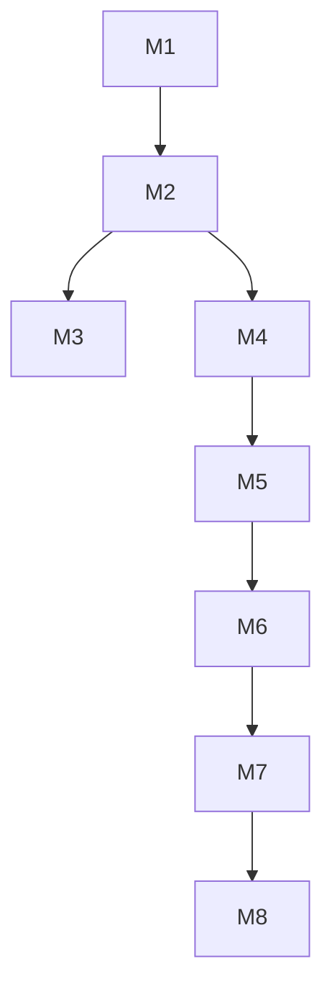

# 1. Identificação básica

## 1.1 Título do experimento

Investigar o impacto de *code reviews* na redução de vulnerabilidades e *code smells* em diferentes linguagens em repositórios *open-source* em diferentes linguagens em repositórios *open-source*

## 1.2 ID / código

trabalho-final-mees-1439652

## 1.3 Versão do documento e histórico de revisão

| Versão | Data | Autor | Descrição das alterações |
|--------|------|-------|-------------------------|
| v1.0 | 20/11/2025 | Ana Carolina | Versão inicial do documento |

## 1.4 Datas (criação, última atualização)

| Evento | Data |
|--------|------|
| Data de criação | 20/11/2025 |
| Última atualização | 20/11/2025 |

## 1.5 Autores (nome, área, contato)

| Nome | Área de atuação | Contato |
|------|-----------------|---------|
| Ana Carolina Caldas de Mello | Engenharia de Software | ana.caldas@sga.pucminas.br |

## 1.6 Responsável principal (PI / dono do experimento)

Ana Carolina Caldas de Mello

## 1.7 Projeto / produto / iniciativa relacionada

Trabalho Final do Medição e Experimentação em Engenharia de Software - PUC Minas. Este experimento está conectado à pesquisa sobre práticas de desenvolvimento de software e qualidade de código, especificamente investigando o impacto de *code reviews* na redução de defeitos e *code smells*.

# 2. Contexto e problema

## 2.1 Descrição do problema / oportunidade

**Problema:**

Vulnerabilidades de software e *code smells* continuam sendo problemas significativos no desenvolvimento de *software*, causando riscos de segurança, aumento de custos de manutenção e redução da qualidade do código (R. Shirey, 2007) (J. Schwarz, A. Steffens e H. Lichter, 2018). Métodos tradicionais de teste podem ser custosos e consumir recursos que muitas organizações não possuem, enquanto problemas críticos continuam aparecendo com frequência em diversos contextos (ABDULLAHI et al., 2020) (GAROUSI et al., 2020).

**Sinais observados:**

- Vulnerabilidades de software causam perdas significativas (exemplos históricos: Mars Polar Lander, Therac-25)
- *Code smells* estão correlacionados com maior probabilidade de defeitos e maior esforço de manutenção
- Métodos tradicionais de teste podem ser custosos e consumir tempo e recursos limitados
- Dados públicos do GitHub oferecem oportunidade única de análise em larga escala de práticas reais de desenvolvimento

**Questão central:**

Existe evidência empírica de que *code reviews* contribuem significativamente para a redução de vulnerabilidades e *code smells* em projetos de software? Qual é a magnitude desse impacto e como varia entre diferentes linguagens de programação e diferentes quantidades de revisões?

## 2.2 Contexto organizacional e técnico

O experimento será conduzido em ambiente acadêmico, executado em máquina particular de baixo poder computacional. A equipe é composta exclusivamente por Ana Carolina, que realizará todas as atividades de coleta, análise e processamento de dados.

**Ferramentas e tecnologias:**
- **API GraphQL do GitHub**: utilizada para extrair dados sobre *pull requests*, *code reviews* e histórico de commits de repositórios públicos
- **SonarQube**: ferramenta de análise estática de código para detecção de vulnerabilidades e *code smells*
- **Power BI**: ferramenta de visualização e análise de dados para criação de dashboards e relatórios
- **Scripts Python**: desenvolvidos para automação da coleta de dados, processamento e análise dos resultados

**Processo de desenvolvimento:**
O experimento seguirá uma abordagem de pesquisa empírica, utilizando dados de repositórios públicos do GitHub. Os scripts Python serão responsáveis pela integração entre as diferentes ferramentas, coletando dados da API do GitHub, processando análises do SonarQube e gerando CSVs para visualizações no Power BI.

## 2.3 Trabalhos e evidências prévias (internos e externos)

Diversos estudos na literatura reforçam a importância de práticas sistemáticas de revisão e melhoria contínua do código. Badampudi, Unterkalmsteiner e Britto (2023) apresentam uma síntese abrangente sobre *code reviews*, demonstrando que *commits* revisados têm menor probabilidade de introduzir defeitos, além de promoverem maior consistência, manutenibilidade e compartilhamento de conhecimento entre desenvolvedores.

Evidências quantitativas também são fornecidas por C. F. Kemerer e M. C. Paulk (2009), que analisam dados do PSP e mostram que revisões de código e design contribuem para a detecção antecipada de problemas, ainda que com taxas mais modestas do que frequentemente se assume no discurso industrial. Complementarmente, J. Schwarz, A. Steffens e H. Lichter(2018) investigam *code smells* em artefatos de *Infrastructure as Code*, mostrando que a presença desses indicadores está associada a maior esforço de manutenção e maior propensão a defeitos, reforçando a necessidade de detectar e mitigar tais problemas estruturais.

Além desses trabalhos, o estudo de Sánchez el at. (2019) apresenta uma análise descritiva de vulnerabilidades de software com base em grandes bases públicas, destacando padrões recorrentes de falhas, classificações comuns (como CWE) e fatores estruturais que contribuem para a introdução de vulnerabilidades, reforçando a necessidade de mecanismos sistemáticos de prevenção e detecção. No conjunto, esses trabalhos fornecem evidências robustas de que práticas como revisão de código, detecção de smells, padronização e monitoramento contínuo de vulnerabilidades contribuem para a melhoria da qualidade e redução de riscos em sistemas de software.

## 2.4 Referencial teórico e empírico essencial

### 2.4.1 *Code Review*

*Code review* é uma prática de engenharia de software na qual desenvolvedores examinam o código escrito por outros membros da equipe antes que seja integrado ao repositório principal. Também conhecido como "peer review" ou "inspeção de código", o *code review* tem como objetivos principais identificar defeitos, melhorar a qualidade do código, compartilhar conhecimento entre a equipe e garantir que o código siga padrões e convenções estabelecidas (BADAMPUDI; UNTERKALMSTEINER; BRITTO, 2023).

Estudos empíricos demonstram que *code reviews* são uma prática eficaz para identificar defeitos antes da produção. Pesquisas mostram que commits revisados têm significativamente menor probabilidade de introduzir *bugs* e que uma parte relevante dos problemas encontrados está relacionada à manutenibilidade e à qualidade interna do código. Além disso, *code reviews* contribuem para melhorar a consistência do código, reforçar padrões e facilitar a transferência de conhecimento entre desenvolvedores (C. F. KEMERER e M. C. PAULK, 2009).

### 2.4.2 Vulnerabilidades

Segundo o estudo realizado por R. Shirey (2007, p.333, tradução livre), as vulnerabilidades de software podem ser definidas como “Uma falha ou fragilidade no projeto, implementação ou na operação e gerenciamento do sistema que pode ser explorada para violar a política de segurança do mesmo”. Elas podem variar desde problemas simples, como uso de variáveis não inicializadas, até erros críticos, como injeção de código e números inteiros maiores que os comportados nesse tipo, como descrito no artigo escrito por Arusoaie et al. (2017). Essas falhas no sistema, se não identificadas e tratadas corretamente, conseguem causar perdas inestimáveis, como a missão do Mars Polar Lander (MPL) e Deep Space 2 (DS2) que, de acordo por Albee et al. (2000), foi um fracasso por causa de um erro de interpretação do software. Outro exemplo seria os acidentes do Therac-25 que expôs pelo menos 6 pessoas a altas doses de radiação, causando prejuízos graves à saúde dos afetados, por causa de um erro de software, como relatado por Levenson e Turner (1993).

Portanto, as vulnerabilidades de software não devem ser negligenciadas. Mesmo assim, entende-se que métodos tradicionais de teste podem consumir tempo e recursos que a organização não possui (ABDULLAHI et al., 2020) (GAROUSI et al., 2020). Além disso, como é destacado pelo estudo de Sánchez et al. (2020), problemas críticos continuam aparecendo com frequência em diversos contextos, reforçando a necessidade de técnicas robustas e automáticas para a detecção dos mesmos.

### 2.4.3 *Code Smells*

*Code smells* são indicadores de problemas de design ou implementação que, embora não sejam necessariamente defeitos funcionais, sugerem que o código pode ser difícil de manter, entender ou estender. Eles são "sintomas" que indicam a necessidade de refatoração (Rahman et al., 2019).

Exemplos comuns de *code smells* incluem: código duplicado, métodos muito longos, classes com muitas responsabilidades, nomes inadequados, parâmetros excessivos, e dependências complexas. A presença de *code smells* está correlacionada com maior probabilidade de introdução de defeitos e maior esforço de manutenção (Rahman et al., 2019).

# 3. Objetivos e questões (Goal / Question / Metric)

## 3.1 Objetivo geral (Goal template)

Investigar o impacto de *code reviews* na redução de vulnerabilidades e *code smells* em diferentes linguagens em repositórios *open-source*

## 3.2 Objetivos específicos

- **1**: Coletar e analisar dados de *code reviews* de repositórios públicos do GitHub, identificando padrões de revisão, frequência e características dos mesmos.

- **2**: Medir a quantidade de vulnerabilidades detectadas antes e depois da realização de *code reviews*, utilizando ferramentas de análise estática (SonarQube).

- **3**: Medir a quantidade de *code smells* presentes no código antes e depois da realização de *code reviews*, identificando melhorias na qualidade do código.

- **4**: Quantificar e comparar o impacto dos *code reviews* na redução de vulnerabilidades e *code smells*, estabelecendo correlações entre práticas de revisão e qualidade do código, considerando diferentes linguagens de programação.

## 3.3 Questões de pesquisa / de negócio

### Questões relacionadas ao Objetivo 1 (Coleta e análise de dados de *code reviews*)

**Q1.1**: Qual é a frequência média de *code reviews* realizados nos repositórios analisados?

**Q1.2**: Quais são os padrões mais comuns de *code reviews* identificados nos repositórios públicos do GitHub?

**Q1.3**: Qual é a distribuição temporal dos *code reviews* ao longo do ciclo de vida dos *pull requests*?

### Questões relacionadas ao Objetivo 2 (Medição de vulnerabilidades)

**Q2.1**: Qual é a quantidade média de vulnerabilidades detectadas antes da realização de *code reviews*?

**Q2.2**: Qual é a redução percentual de vulnerabilidades após a realização de *code reviews*?

**Q2.3**: Existem diferenças significativas na redução de vulnerabilidades entre repositórios com diferentes frequências de *code reviews*?

### Questões relacionadas ao Objetivo 3 (Medição de *code smells*)

**Q3.1**: Qual é a quantidade média de *code smells* presentes no código antes da realização de *code reviews*?

**Q3.2**: Qual é a redução percentual de *code smells* após a realização de *code reviews*?

**Q3.3**: Quais tipos de *code smells* são mais frequentemente identificados e corrigidos durante *code reviews*?

### Questões relacionadas ao Objetivo 4 (Quantificação do impacto)

**Q4.1**: Qual é o impacto quantitativo dos *code reviews* na redução combinada de vulnerabilidades e *code smells*?

**Q4.2**: Existe uma relação estatisticamente significativa entre a realização de *code reviews* e a melhoria da qualidade do código?

**Q4.3**: Qual é a eficácia relativa dos *code reviews* em reduzir vulnerabilidades versus *code smells*?

**Q4.4**: Existem diferenças no impacto dos *code reviews* entre diferentes linguagens de programação?

**Q4.5**: Qual linguagem de programação apresenta maior correlação entre quantidade de *code reviews* e redução de vulnerabilidades?

**Q4.6**: Qual linguagem de programação apresenta maior correlação entre quantidade de *code reviews* e redução de *code smells*?

## 3.4 Métricas associadas (GQM)

| Métrica | Definição | Unidade | Fonte dos Dados |
|---------|-----------|---------|-----------------|
| Vulnerabilidades antes do *merge* | Quantidade de vulnerabilidades detectadas no código antes do *merge* do pull request | Número inteiro | SonarQube |
| Vulnerabilidades após o *merge* | Quantidade de vulnerabilidades detectadas no código após o *merge* do pull request | Número inteiro | SonarQube |
| *Code smells* antes do *merge* | Quantidade de *code smells* detectados no código antes do *merge* do pull request | Número inteiro | SonarQube |
| *Code smells* após o *merge* | Quantidade de *code smells* detectados no código após o *merge* do pull request | Número inteiro | SonarQube |
| Redução percentual de vulnerabilidades | ((Vulnerabilidades antes - Vulnerabilidades depois) / Vulnerabilidades antes) × 100 | Percentual | Calculada |
| Redução percentual de *code smells* | ((*Code smells* antes - *Code smells* depois) / *Code smells* antes) × 100 | Percentual | Calculada |
| Redução combinada (vulnerabilidades + *code smells*) | Soma das reduções absolutas de vulnerabilidades e *code smells* | Número inteiro | Calculada |
| Tempo até o *merge* | Tempo decorrido desde a abertura do pull request até o *merge* | Horas/Dias | API GraphQL do GitHub |
| Quantidade de interações no pull request | Número total de comentários, aprovações e alterações no pull request | Número inteiro | API GraphQL do GitHub |
| Quantidade de *code reviews* | Número de *code reviews* realizados em um pull request | Número inteiro | API GraphQL do GitHub |
| Severidade das vulnerabilidades | Classificação da severidade das vulnerabilidades (Crítica, Alta, Média, Baixa) | Categórica | SonarQube |
| Severidade dos *code smells* | Classificação da severidade dos *code smells* (Bloqueador, Crítica, Maior, Menor, Info) | Categórica | SonarQube |
| Tipos de *code smells* corrigidos | Frequência de correção por tipo de *code smell* | Categórica | SonarQube |
| Tamanho do *pull request* | Número de linhas modificadas no *pull request* | Número inteiro | API GraphQL do GitHub |
| Linguagem de programação | Linguagem de programação principal do repositório | Categórica | API GraphQL do GitHub |

### Associação de Métricas às Questões

| Questão | Descrição | Métricas Associadas |
|---------|-----------|---------------------|
| Q1.1 | Frequência média de *code reviews* | Quantidade de *code reviews* (média por repositório) e Linguagem de programação |
| Q1.2 | Padrões mais comuns de *code reviews* | Quantidade de *code reviews*, Quantidade de interações no pull request e Tempo até o *merge* |
| Q1.3 | Distribuição temporal dos *code reviews* | Tempo até o merge e Quantidade de *code reviews* |
| Q2.1 | Quantidade média de vulnerabilidades antes | Vulnerabilidades antes do *merge* (média), Linguagem de programação e Severidade das vulnerabilidades |
| Q2.2 | Redução percentual de vulnerabilidades | Vulnerabilidades antes do *merge*, Vulnerabilidades após o *merge*, Redução percentual de vulnerabilidades e Quantidade de *code reviews* |
| Q2.3 | Diferenças na redução de vulnerabilidades | Vulnerabilidades antes do *merge*, Vulnerabilidades após o *merge*, Redução percentual de vulnerabilidades, Quantidade de *code reviews* e Severidade das vulnerabilidades |
| Q3.1 | Quantidade média de *code smells* antes | *Code smells* antes do *merge* (média), Linguagem de programação e Severidade dos *code smells* |
| Q3.2 | Redução percentual de *code smells* | *Code smells* antes do *merge*, *Code smells* após o *merge*, Redução percentual de *code smells* e Quantidade de *code reviews* |
| Q3.3 | Tipos de *code smells* mais corrigidos | *Code smells* antes do *merge*, *Code smells* após o *merge*, Tipos de *code smells* corrigidos, Severidade dos *code smells* e Quantidade de *code reviews* |
| Q4.1 | Impacto quantitativo combinado | Vulnerabilidades antes do *merge*, Vulnerabilidades após o *merge*, *Code smells* antes do *merge*, *Code smells* após o *merge*, Redução combinada (vulnerabilidades + *code smells*) e Quantidade de *code reviews* |
| Q4.2 | Relação estatisticamente significativa | Quantidade de *code reviews*, Vulnerabilidades antes do *merge*, Vulnerabilidades após o *merge*, *Code smells* antes do *merge*, *Code smells* após o *merge*, Redução percentual de vulnerabilidades e Redução percentual de *code smells* |
| Q4.3 | Eficácia relativa | Quantidade de *code reviews*, Redução percentual de vulnerabilidades, Redução percentual de *code smells*, Severidade das vulnerabilidades e Severidade dos *code smells* |
| Q4.4 | Diferenças no impacto por linguagem | Linguagem de programação, Quantidade de *code reviews*, Vulnerabilidades antes do *merge*, Vulnerabilidades após o *merge*, *Code smells* antes do *merge*, *Code smells* após o *merge*, Redução percentual de vulnerabilidades e Redução percentual de *code smells* |
| Q4.5 | Correlação linguagem × *code reviews* × vulnerabilidades | Linguagem de programação, Quantidade de *code reviews*, Vulnerabilidades antes do *merge*, Vulnerabilidades após o *merge*, Redução percentual de vulnerabilidades e Severidade das vulnerabilidades |
| Q4.6 | Correlação linguagem × *code reviews* × *code smells* | Linguagem de programação, Quantidade de *code reviews*, *Code smells* antes do *merge*, *Code smells* após o *merge*, Redução percentual de *code smells* e Severidade dos *code smells* |

# 4. Escopo e contexto do experimento

## 4.1 Escopo funcional / de processo (incluído e excluído)

### Escopo incluído

**Linguagens de programação:**
- As 5 linguagens mais populares do GitHub serão selecionadas para análise

**Repositórios:**
- 500 repositórios mais populares de cada uma das 5 linguagens selecionadas
- Total de 2.500 repositórios analisados

***Pull requests*:**
- 1.000 *pull requests* ao todo de cada linguagem de programação
- Total de 5.000 *pull requests* analisados
- Inclui *pull requests* com *code reviews* e *pull requests* sem *code reviews* (grupo controle) para comparação

**Atividades cobertas:**
- Coleta de dados de *code reviews* via API GraphQL do GitHub
- Identificação e seleção de *pull requests* com e sem *code reviews* para análise comparativa
- Análise estática de código utilizando SonarQube para detecção de vulnerabilidades e *code smells*
- Análise comparativa antes e após o *merge* dos *pull requests*
- Análise de correlações entre *code reviews*, vulnerabilidades e *code smells*
- Comparação entre *pull requests* com diferentes quantidades de *code reviews* e PR sem *code reviews*
- Análise comparativa entre diferentes linguagens de programação

### Escopo excluído

- Repositórios privados
- *Pull requests* fechados sem *merge*
- Análise de código em linguagens fora das 5 selecionadas
- Análise de aspectos de desempenho
- Análise de aspectos de *design* de *interface* ou experiência do usuário
- Análise de documentação ou comentários no código

## 4.2 Contexto do estudo (tipo de organização, projeto, experiência)

O estudo é acadêmico, conduzido apenas por uma pessoa. Os objetos de análise são repositórios públicos do GitHub (*open-source*) de projetos ativos e com histórico suficiente (*commits*, PRs e análise SonarQube viável). Não há interação com equipes dos projetos analisados (estudo observacional/analítico), portanto participantes humanos não serão submetidos a intervenções. A experiência da pesquisadora inclui programação, uso de APIs/Git/SonarQube e ferramentas de análise de dados.

## 4.3 Premissas

- A API GraphQL do GitHub fornece dados completos necessários (comentários, *reviews*, *commits*, *timestamps*) para os PRs selecionados.
- SonarQube consegue analisar as versões de código por *commits*.
- Repositórios selecionados são públicos e não têm restrições de licença que impeçam análise.
- Máquina individual com recursos suficientes para executar análises do SonarQube.
- As amostras de PRs por linguagem representam práticas típicas das comunidades dessas linguagens.

## 4.4 Restrições

- Tempo limitado e capacidade computacional reduzida.
- Mão de obra limitada, por se trartar de uma pesquisa individual.
- Dados dependem da disponibilidade/consistência da API do GitHub.
- Exclusão de PRs fechados/sem *merge* reduz a visibilidade de correções que não chegaram à base principal.
- Foco em cinco linguagens limita generalização para outras linguagens.

## 4.5 Limitações previstas

- **Validade externa**: resultados podem não generalizar para repositórios privados, empresas com processos formais de revisão ou projetos de nicho.
- **Causalidade**: estudo observacional limita inferências causais (p.ex. projetos que fazem mais *code reviews* podem também ter cultura ou ferramentas que, por si só, reduzem vulnerabilidades).
- **Dependência de SonarQube**: detecções são dependentes das regras ativadas e da qualidade dos métodos de análise para cada linguagem.

# 5. Stakeholders e impacto esperado

## 5.1 Stakeholders principais

Liste os grupos ou papéis que têm interesse ou serão impactados pelo experimento (por exemplo, devs, QA, produto, gestores, clientes internos).

## 5.2 Interesses e expectativas dos stakeholders

Descreva o que cada grupo espera obter do experimento (insights, evidências, validação de decisão, mitigação de risco, etc.).

## 5.3 Impactos potenciais no processo / produto

Antecipe como a execução do experimento pode afetar prazos, qualidade, carga de trabalho ou o próprio produto durante e após o estudo.

# 6. Riscos de alto nível, premissas e critérios de sucesso

## 6.1 Riscos de alto nível (negócio, técnicos, etc.)

- API do GitHub com número máximo de requisições e mudanças inesperadas.
- Falha na execução do SonarQube em certas linguagens/versões.
- Amostragem enviesada (projetos populares que não representam a população).
- Problemas computacionais (memória/CPU) na máquina local para análises em lote.
- Erros na correlação entre *commits*/PRs e *snapshots* analisados.

## 6.2 Critérios de sucesso globais (go / no-go)

- ***Go***: Coleta bem-sucedida de pelo menos 80% das métricas planejadas para a amostra alvo, correspondendo a no mínimo 4.000 *pull requests* analisáveis, e tamanho de amostra suficiente para que os testes estatísticos tenham pelo menos 80% de probabilidade de detectar efeitos reais quando eles existirem (poder estatístico ≥ 0,8).
- ***No-go***: Incapacidade técnica de executar SonarQube nas versões de código selecionadas, ou taxa de coleta de PRs/artefatos < 30% do planejado.

## 6.3 Critérios de parada antecipada (pré-execução)

- Falta de acesso à API do GitHub, limite de requisições se tornam um impedimento.
- Incapacidade técnica de rodar análises Sonar para ≥50% das amostras piloto.
- Descoberta de impedimentos éticos ou legais (por exemplo, análise violaria termos específicos de algum repositório escolhido).

# 7. Modelo conceitual e hipóteses

## 7.1 Modelo conceitual do experimento

O modelo conceitual propõe que a realização de *code reviews* em *pull requests* está associada à redução de vulnerabilidades e *code smells* detectados no código. Especificamente, espera-se que *pull requests* com maior quantidade de *code reviews* apresentem maior redução de vulnerabilidades e *code smells* entre o estado antes e após o *merge*. O modelo controla por linguagem de programação, tempo até o *merge* e quantidade de interações no *pull request*, considerando que esses fatores podem influenciar tanto a quantidade de *code reviews* quanto a redução de problemas detectados.

## 7.2 Hipóteses formais (H0, H1)

### Q1.1

**H0**: A frequência média de *code reviews* nos repositórios analisados é igual ou inferior a 1.

**H1**: A frequência média de *code reviews* nos repositórios analisados é superior a 1, indicando prática consistente de revisão de código.

### Q1.2

**H0**: Não existem padrões consistentes de *code reviews* identificáveis nos repositórios públicos do GitHub.

**H1**: Existem padrões consistentes e identificáveis de *code reviews* nos repositórios públicos do GitHub, relacionados à quantidade de interações, tempo até o *merge* e quantidade de *code reviews*.

### Q1.3

**H0**: A distribuição temporal dos *code reviews* ao longo do ciclo de vida dos *pull requests* é aleatória ou uniforme.

**H1**: A distribuição temporal dos *code reviews* segue um padrão não aleatório, com concentração em períodos específicos do ciclo de vida dos *pull requests*.

### Q2.1

**Valor de referência**: Mediana (percentil 50) da quantidade de vulnerabilidades detectadas antes da realização de *code reviews* em toda a amostra de *pull requests*.

**H0**: A quantidade média de vulnerabilidades detectadas antes da realização de *code reviews* é igual ou inferior à mediana da amostra.

**H1**: A quantidade média de vulnerabilidades detectadas antes da realização de *code reviews* é superior à mediana da amostra, indicando necessidade de revisão.

### Q2.2

**H0**: Não há diferença significativa na quantidade de vulnerabilidades entre *pull requests* com e sem *code reviews* (ou entre diferentes quantidades de *code reviews*).

**H1**: *Pull requests* com maior quantidade de *code reviews* apresentam redução significativamente maior de vulnerabilidades após o *merge* em comparação com *pull requests* com menor quantidade ou sem *code reviews*.

### Q2.3

**H0**: Não existem diferenças significativas na redução de vulnerabilidades entre repositórios com diferentes frequências de *code reviews*.

**H1**: Existem diferenças significativas na redução de vulnerabilidades entre repositórios com diferentes frequências de *code reviews*, com repositórios de maior frequência apresentando maior redução.

### Q3.1

**Valor de referência**: Mediana (percentil 50) da quantidade de *code smells* presentes no código antes da realização de *code reviews* em toda a amostra de *pull requests*.

**H0**: A quantidade média de *code smells* presentes no código antes da realização de *code reviews* é igual ou inferior à mediana da amostra.

**H1**: A quantidade média de *code smells* presentes no código antes da realização de *code reviews* é superior à mediana da amostra, indicando necessidade de revisão.

### Q3.2

**H0**: Não há diferença significativa na quantidade de *code smells* entre *pull requests* com e sem *code reviews* (ou entre diferentes quantidades de *code reviews*).

**H1**: *Pull requests* com maior quantidade de *code reviews* apresentam redução significativamente maior de *code smells* após o *merge* em comparação com *pull requests* com menor quantidade ou sem *code reviews*.

### Q3.3

**H0**: Não há diferenças significativas na frequência de identificação e correção de diferentes tipos de *code smells* durante *code reviews*.

**H1**: Existem diferenças significativas na frequência de identificação e correção de diferentes tipos de *code smells* durante *code reviews*, com alguns tipos sendo mais frequentemente corrigidos.

### Q4.1

**H0**: O impacto quantitativo dos *code reviews* na redução combinada de vulnerabilidades e *code smells* é nulo ou desprezível.

**H1**: O impacto quantitativo dos *code reviews* na redução combinada de vulnerabilidades e *code smells* é significativo e mensurável.

### Q4.2

**H0**: Não existe relação estatisticamente significativa entre a quantidade de *code reviews* e a melhoria da qualidade do código (redução combinada de vulnerabilidades e *code smells*).

**H1**: Existe relação estatisticamente significativa e positiva entre a quantidade de *code reviews* e a melhoria da qualidade do código, controlando-se por linguagem de programação, tempo até o *merge* e quantidade de interações.

### Q4.3

**H0**: A eficácia dos *code reviews* em reduzir vulnerabilidades é igual à eficácia em reduzir *code smells*.

**H1**: A eficácia dos *code reviews* em reduzir vulnerabilidades é diferente da eficácia em reduzir *code smells*, com uma das métricas apresentando maior redução relativa.

### Q4.4

**H0**: Não há diferenças significativas no impacto dos *code reviews* na redução de vulnerabilidades e *code smells* entre diferentes linguagens de programação.

**H1**: Existem diferenças significativas no impacto dos *code reviews* entre diferentes linguagens de programação, com algumas linguagens apresentando maior correlação entre quantidade de *code reviews* e redução de problemas.

### Q4.5

**H0**: Não há diferenças significativas na correlação entre quantidade de *code reviews* e redução de vulnerabilidades entre diferentes linguagens de programação.

**H1**: Existem diferenças significativas na correlação entre quantidade de *code reviews* e redução de vulnerabilidades entre diferentes linguagens de programação, com pelo menos uma linguagem apresentando correlação significativamente maior.

### Q4.6

**H0**: Não há diferenças significativas na correlação entre quantidade de *code reviews* e redução de *code smells* entre diferentes linguagens de programação.

**H1**: Existem diferenças significativas na correlação entre quantidade de *code reviews* e redução de *code smells* entre diferentes linguagens de programação, com pelo menos uma linguagem apresentando correlação significativamente maior

## 7.3 Nível de significância e considerações de poder

Defina o nível de significância (por exemplo, α = 0,05) e comente o que se espera em termos de poder estatístico, relacionando-o ao tamanho de amostra planejado.

# 8. Variáveis, fatores, tratamentos e objetos de estudo

## 8.1 Objetos de estudo

Os objetos de estudo são *pull requests* de repositórios públicos do GitHub, que serão categorizados em dois grupos principais:

1. **PRs com *code reviews***: *pull requests* que receberam pelo menos um *code review* antes do *merge*
2. **PRs sem *code reviews***: *pull requests* que foram mesclados sem receber *code reviews* (grupo controle)

Para cada pull request, serão analisados:
- O código antes e após o *merge* (através de *commits*)
- A quantidade de *code reviews* realizados (quando aplicável)
- As vulnerabilidades detectadas antes e após o *merge*
- Os *code smells* detectados antes e após o *merge*
- Metadados do pull request (tempo até *merge*, interações, linguagem de programação)

## 8.2 Sujeitos / participantes (visão geral)

**Não aplicável** - Este é um estudo observacional que analisa dados históricos de *pull requests* e repositórios públicos do GitHub. Não há participantes humanos sendo recrutados, submetidos a intervenções ou interagindo diretamente com o experimento.

**Unidades de análise:**

As unidades de análise são *pull requests* mesclados em repositórios públicos do GitHub. Cada *pull request* representa uma unidade de observação, contendo:
- Código-fonte modificado
- Histórico de *code reviews*
- Metadados do processo de desenvolvimento
- Resultados de análise estática (vulnerabilidades e *code smells*)

Os desenvolvedores que criaram os *pull requests* não são participantes do estudo, apenas seus artefatos públicos (código e metadados) são analisados de forma agregada e anonimizada.

## 8.3 Variáveis independentes (fatores) e seus níveis

**Fator principal: Presença e quantidade de *code reviews***

- **Nível 1**: *Pull requests* sem *code reviews* (0 *code reviews*) - grupo controle
- **Nível 2**: *Pull requests* com poucos *code reviews* (1-2 *code reviews*)
- **Nível 3**: *Pull requests* com quantidade média de *code reviews* (3-5 *code reviews*)
- **Nível 4**: *Pull requests* com muitos *code reviews* (6 ou mais *code reviews*)

**Fator secundário: Linguagem de programação**

- Nível: 5 linguagens mais populares do GitHub (a serem definidas na coleta)

**Fator de controle: Tempo até o *merge***

- Será usado como variável de controle para balanceamento entre grupos

## 8.4 Tratamentos (condições experimentais)

O experimento utiliza um desenho observacional com as seguintes condições:

**Grupo Controle (T0)**: PRs sem *code reviews*
- *Pull requests* que foram mesclados sem receber nenhum *code review*
- Utilizado como baseline para comparação

**Tratamento 1 (T1)**: PRs com poucos *code reviews* (1-2)
- *Pull requests* que receberam 1 ou 2 *code reviews* antes do *merge*

**Tratamento 2 (T2)**: PRs com quantidade média de *code reviews* (3-5)
- *Pull requests* que receberam entre 3 e 5 *code reviews* antes do *merge*

**Tratamento 3 (T3)**: PRs com muitos *code reviews* (6+)
- *Pull requests* que receberam 6 ou mais *code reviews* antes do *merge*

As condições são definidas naturalmente pelos dados coletados, permitindo análise comparativa do impacto da quantidade de *code reviews* na redução de vulnerabilidades e *code smells*.

## 8.5 Variáveis dependentes (respostas)

As variáveis dependentes são as medidas de resultado que indicam o impacto dos *code reviews* na qualidade do código:

**Variáveis dependentes principais:**

1. **Quantidade de vulnerabilidades após o *merge***:
   - Medida: Número inteiro de vulnerabilidades detectadas pelo SonarQube
   - Comparação: Com quantidade antes do *merge* e com grupo sem *code reviews*

2. **Quantidade de *code smells* após o *merge***:
   - Medida: Número inteiro de *code smells* detectados pelo SonarQube
   - Comparação: Com quantidade antes do *merge* e com grupo sem *code reviews*

3. **Redução percentual de vulnerabilidades**:
   - Medida: ((Vulnerabilidades antes - Vulnerabilidades depois) / Vulnerabilidades antes) × 100
   - Indica: Efetividade dos *code reviews* em reduzir vulnerabilidades
   - Requer: Vulnerabilidades antes e após o *merge*

4. **Redução percentual de *code smells***:
   - Medida: ((*Code smells* antes - *Code smells* depois) / *Code smells* antes) × 100
   - Indica: Efetividade dos *code reviews* em reduzir *code smells*
   - Requer: *Code smells* antes e após o *merge*

5. **Redução combinada (vulnerabilidades + *code smells*)**:
   - Medida: Soma das reduções absolutas de vulnerabilidades e *code smells*
   - Indica: Impacto geral dos *code reviews* na qualidade do código
   - Requer: Todas as métricas anteriores

**Variáveis dependentes secundárias:**

6. **Severidade das vulnerabilidades**: Distribuição por nível de severidade

7. **Severidade dos *code smells***: Distribuição por nível de severidade

8. **Tipos de *code smells* corrigidos**: Frequência de correção por tipo de *code smell*

**Métricas coletadas para cálculo das variáveis dependentes:**

As seguintes métricas são coletadas e utilizadas para calcular as variáveis dependentes acima:

- **Vulnerabilidades antes do *merge***: *Baseline* para cálculo de redução percentual
- **Vulnerabilidades após o *merge***: Resultado final após *code reviews*
- ***Code smells* antes do *merge***: *Baseline* para cálculo de redução percentual
- ***Code smells* após o *merge***: Resultado final após *code reviews*
- **Tempo até o *merge***: Usado como variável de controle
- **Quantidade de interações no *pull request***: Usado como variável de controle
- **Quantidade de *code reviews***: Variável independente principal
- **Linguagem de programação**: Usado para formação de blocos e análise comparativa

## 8.6 Variáveis de controle / bloqueio

Variáveis que não são objeto de estudo direto, mas serão controladas para garantir comparabilidade entre grupos:

**Variáveis mantidas constantes ou balanceadas:**

1. **Tipo de repositório**:
   - Apenas repositórios públicos do GitHub
   - Exclusão de repositórios privados ou com restrições de acesso

2. **Status do *pull request***:
   - Apenas *pull requests* mesclados com sucesso
   - Exclusão de *pull requests* fechados sem *merge*

3. **Período temporal**:
   - Balanceamento temporal para evitar efeitos de tendências ou mudanças nas práticas ao longo do tempo
   - Distribuição de *pull requests* ao longo de diferentes períodos

4. **Tamanho/complexidade do repositório**:
   - Consideração de popularidade/tamanho do repositório no balanceamento
   - Evitar que repositórios muito grandes dominem a amostra

**Variáveis usadas para formar blocos:**

1. **Linguagem de programação**:
   - Blocos formados por cada uma das 5 linguagens selecionadas
   - Análise separada por linguagem para controlar efeitos específicos

2. **Quantidade de *code reviews* (estratificação)**:
   - Blocos: sem *code reviews* (0), poucos (1-2), médios (3-5), muitos (6+)
   - Permite análise do efeito incremental da quantidade de revisões

**Variáveis controladas estatisticamente:**

1. **Tempo até o *merge***: Incluída como covariável em modelos de regressão

2. **Quantidade de interações no *pull request***: Incluída como covariável para controlar atividade geral do PR

3. **Tamanho do *pull request***: Número de linhas modificadas como covariável

## 8.7 Possíveis variáveis de confusão conhecidas

Fatores que podem influenciar tanto a quantidade de *code reviews* quanto a redução de vulnerabilidades/*code smells*, potencialmente distorcendo a relação observada:

**Variáveis de confusão identificadas:**

1. **Cultura e práticas do projeto**:
   - **Ameaça**: Projetos com cultura de qualidade podem fazer mais *code reviews* e ter menos problemas por outras razões
   - **Monitoramento**: Análise de características dos repositórios (idade, tamanho e atividade)
   - **Controle**: Balanceamento por popularidade/tamanho e análise de subgrupos

2. **Complexidade e criticidade do código**:
   - **Ameaça**: Código mais complexo pode receber mais *code reviews* E ter mais problemas naturalmente
   - **Monitoramento**: Análise de métricas de complexidade (quando disponível)
   - **Controle**: Consideração de tamanho do PR e análise de subgrupos por complexidade

3. **Ferramentas e processos de desenvolvimento**:
   - **Ameaça**: Projetos com melhores ferramentas podem ter menos problemas independentemente de *code reviews*
   - **Monitoramento**: Observação de ferramentas mencionadas (CI/CD, linters, etc.)
   - **Controle**: Análise de subgrupos e reconhecimento de limitação em discussão

4. **Pressão de prazo e contexto organizacional**:
   - **Ameaça**: Projetos com menos pressão podem ter mais *code reviews* e mais tempo para corrigir problemas
   - **Monitoramento**: Análise de padrões temporais (ex: mais *code reviews* em períodos menos críticos)
   - **Controle**: Balanceamento temporal e análise de tendências

5. **Qualidade inicial do código**:
   - **Ameaça**: Código com muitos problemas iniciais pode receber mais *code reviews* e ter maior redução absoluta
   - **Monitoramento**: Análise de vulnerabilidades/*code smells* antes do *merge* como *baseline*
   - **Controle**: Análise de redução percentual (não absoluta) e controle por *baseline* em regressão

**Estratégias de controle:**

- **Controle estatístico**: Inclusão de variáveis de confusão conhecidas em modelos de regressão múltipla
- **Análise de subgrupos**: Verificar se efeitos são consistentes em diferentes subgrupos
- **Análise de sensibilidade**: Testar robustez dos resultados considerando diferentes suposições sobre variáveis de confusão
- **Reconhecimento de limitações**: Discussão explícita de variáveis de confusão não controladas e suas implicações

## 8.8 Tabela consolidada de variáveis

| Variável | Tipo | Descrição | Unidade/Tipo de Dado | Fonte |
|----------|------|-----------|---------------------|-------|
| **Variáveis Independentes (Fatores)** |||||
| Quantidade de *code reviews* | Independente | Número de *code reviews* realizados em um *pull request* antes do *merge* | Número inteiro (0, 1-2, 3-5, 6+) | API GraphQL do GitHub |
| Linguagem de programação | Independente | Linguagem de programação principal do repositório | Categórica (5 linguagens) | API GraphQL do GitHub |
| **Variáveis Dependentes (Respostas)** |||||
| Vulnerabilidades antes do *merge* | Dependente | Quantidade de vulnerabilidades detectadas no código antes do *merge* do *pull request* | Número inteiro | SonarQube |
| Vulnerabilidades após o *merge* | Dependente | Quantidade de vulnerabilidades detectadas no código após o *merge* do *pull request* | Número inteiro | SonarQube |
| *Code smells* antes do *merge* | Dependente | Quantidade de *code smells* detectados no código antes do *merge* do *pull request* | Número inteiro | SonarQube |
| *Code smells* após o *merge* | Dependente | Quantidade de *code smells* detectados no código após o *merge* do *pull request* | Número inteiro | SonarQube |
| Redução percentual de vulnerabilidades | Dependente | ((Vulnerabilidades antes - Vulnerabilidades depois) / Vulnerabilidades antes) × 100 | Percentual | Calculada |
| Redução percentual de *code smells* | Dependente | ((*Code smells* antes - *Code smells* depois) / *Code smells* antes) × 100 | Percentual | Calculada |
| Redução combinada | Dependente | Soma das reduções absolutas de vulnerabilidades e *code smells* | Número inteiro | Calculada |
| Severidade das vulnerabilidades | Dependente | Classificação da severidade das vulnerabilidades | Categórica (Crítica, Alta, Média, Baixa) | SonarQube |
| Severidade dos *code smells* | Dependente | Classificação da severidade dos *code smells* | Categórica (Bloqueador, Crítica, Maior, Menor, Info) | SonarQube |
| Tipos de *code smells* corrigidos | Dependente | Frequência de correção por tipo de *code smell* | Categórica | SonarQube |
| **Variáveis de Controle** |||||
| Tempo até o *merge* | Controle | Tempo decorrido desde a abertura do *pull request* até o *merge* | Horas/Dias | API GraphQL do GitHub |
| Quantidade de interações no *pull request* | Controle | Número total de comentários, aprovações e alterações no *pull request* | Número inteiro | API GraphQL do GitHub |
| Tamanho do *pull request* | Controle | Número de linhas modificadas no *pull request* | Número inteiro | API GraphQL do GitHub |
| Período temporal | Controle | Período de criação do *pull request* para balanceamento temporal | Data/Timestamp | API GraphQL do GitHub |
| Tamanho/complexidade do repositório | Controle | Popularidade/tamanho do repositório | Número inteiro (estrelas, forks) | API GraphQL do GitHub |

## 8.9 Tabela consolidada de fatores, tratamentos e combinações

| Fator | Tipo | Níveis/Tratamentos | Descrição | Combinações Experimentais |
|-------|------|---------------------|-----------|---------------------------|
| **Presença e quantidade de *code reviews*** | Fator Principal | **T0 (Controle)**: 0 *code reviews* | *Pull requests* mesclados sem receber nenhum *code review* | T0 × 5 linguagens = 5 combinações |
| | | **T1**: 1-2 *code reviews* | *Pull requests* que receberam 1 ou 2 *code reviews* antes do *merge* | T1 × 5 linguagens = 5 combinações |
| | | **T2**: 3-5 *code reviews* | *Pull requests* que receberam entre 3 e 5 *code reviews* antes do *merge* | T2 × 5 linguagens = 5 combinações |
| | | **T3**: 6+ *code reviews* | *Pull requests* que receberam 6 ou mais *code reviews* antes do *merge* | T3 × 5 linguagens = 5 combinações |
| **Linguagem de programação** | Fator Secundário | 5 linguagens mais populares do GitHub | Linguagens a serem definidas na coleta (ex: JavaScript, Python, Java, etc.) | 4 tratamentos × 5 linguagens = 20 combinações |
| **Tempo até o *merge*** | Fator de Controle | Variável contínua | Tempo decorrido desde a abertura até o *merge* (usado para balanceamento) | Controlado estatisticamente |
| **Quantidade de interações** | Fator de Controle | Variável contínua | Número total de comentários, aprovações e alterações (usado como covariável) | Controlado estatisticamente |
| **Tamanho do *pull request*** | Fator de Controle | Variável contínua | Número de linhas modificadas (usado como covariável) | Controlado estatisticamente |

**Total de combinações experimentais:** 20 combinações (4 tratamentos × 5 linguagens)

**Distribuição planejada:**
- 250 *pull requests* por combinação (tratamento × linguagem)
- Total: 5.000 *pull requests* (20 combinações × 250 PRs)

# 9. Desenho experimental

## 9.1 Tipo de desenho (completamente randomizado, blocos, fatorial, etc.)

O experimento utiliza um **desenho observacional comparativo** com grupos naturais. Os *pull requests* serão categorizados em grupos baseados na quantidade de *code reviews* recebidos:

- **Grupo controle**: *Pull requests* sem *code reviews* (0 *code reviews*)
- **Grupos de tratamento**: *Pull requests* com diferentes quantidades de *code reviews* (1-2, 3-5, 6+)

Este desenho é adequado porque:
1. Permite comparação entre *pull requests* com e sem *code reviews* (grupo controle vs. tratamentos)
2. Não requer manipulação experimental, utilizando dados naturalmente existentes
3. Facilita análise do impacto incremental da quantidade de *code reviews*
4. Permite controle por variáveis como linguagem de programação e tempo até o *merge*

## 9.2 Randomização e alocação

Como este é um estudo observacional, não há randomização de tratamentos (os *pull requests* já possuem naturalmente diferentes quantidades de *code reviews*). No entanto, será realizada:

- **Seleção aleatória de *pull requests***: Dentro de cada categoria (com/sem *code reviews* e por quantidade), os *pull requests* serão selecionados aleatoriamente dos repositórios identificados para garantir representatividade
- **Balanceamento por linguagem**: A amostra será balanceada para incluir proporções similares de *pull requests* com e sem *code reviews* em cada linguagem de programação
- **Balanceamento temporal**: Será considerado o período de criação dos *pull requests* para evitar viés temporal

A alocação será feita através de scripts Python que identificam e categorizam *pull requests* baseado na presença e quantidade de *code reviews*.

## 9.3 Balanceamento e contrabalanço

**Balanceamento entre grupos:**

- **Por linguagem**: Garantir proporções similares de *pull requests* com e sem *code reviews* em cada uma das 5 linguagens
- **Por tamanho do repositório**: Considerar popularidade/tamanho do repositório para evitar que repositórios muito grandes dominem a amostra
- **Por período temporal**: Distribuir *pull requests* ao longo de diferentes períodos para evitar efeitos sazonais ou de tendências temporais
- **Por complexidade**: Quando possível, considerar métricas de complexidade do código para balanceamento

**Contrabalanço:**

Não aplicável neste estudo, pois não há efeitos de ordem ou aprendizagem (os *pull requests* são eventos históricos já completados, não há sequência experimental).

## 9.4 Número de grupos e sessões

**Número de grupos:** 4 grupos principais

1. **Grupo Controle (T0)**: *Pull requests* sem *code reviews* - aproximadamente 25% da amostra (1.250 PRs)
2. **Grupo T1**: *Pull requests* com 1-2 *code reviews* - aproximadamente 25% da amostra (1.250 PRs)
3. **Grupo T2**: *Pull requests* com 3-5 *code reviews* - aproximadamente 25% da amostra (1.250 PRs)
4. **Grupo T3**: *Pull requests* com 6+ *code reviews* - aproximadamente 25% da amostra (1.250 PRs)

**Distribuição por linguagem:** Cada grupo será subdividido pelas 5 linguagens de programação, resultando em 20 subgrupos (4 grupos × 5 linguagens), com aproximadamente 250 *pull requests* por subgrupo.

**Sessões:** Não aplicável, pois este é um estudo observacional de dados históricos, não um experimento com sessões experimentais.

# 10. População, sujeitos e amostragem

## 10.1 População-alvo

A população-alvo consiste em:

- **PRs mesclados** em repositórios públicos do GitHub
- **Repositórios** das 5 linguagens de programação mais populares do GitHub
- **PRs com e sem *code reviews*** de projetos *open-source* ativos

Especificamente, a população inclui:
- PRs que foram mesclados com sucesso (não fechados sem *merge*)
- PRs de repositórios públicos e populares (top 500 por linguagem)
- PRs que podem ou não ter recebido *code reviews* antes do *merge*
- PRs com histórico suficiente para análise antes e após o *merge*

## 10.2 Critérios de inclusão de sujeitos

Especifique os requisitos mínimos para um participante ser elegível (experiência, conhecimento, papel, disponibilidade, etc.).

## 10.3 Critérios de exclusão de sujeitos

Liste condições que impedem participação (conflitos de interesse, falta de skills essenciais, restrições legais ou éticas).

## 10.4 Tamanho da amostra planejado (por grupo)

**Tamanho total da amostra:** 5.000 *pull requests*

**Distribuição por grupo:**

- **Grupo Controle (sem *code reviews*)**: 1.250 *pull requests* (25% da amostra)
  - 250 *pull requests* por linguagem (5 linguagens × 250 = 1.250)

- **Grupo T1 (1-2 *code reviews*)**: 1.250 *pull requests* (25% da amostra)
  - 250 *pull requests* por linguagem

- **Grupo T2 (3-5 *code reviews*)**: 1.250 *pull requests* (25% da amostra)
  - 250 *pull requests* por linguagem

- **Grupo T3 (6+ *code reviews*)**: 1.250 *pull requests* (25% da amostra)
  - 250 *pull requests* por linguagem

**Justificativa:**

- O tamanho de 1.250 *pull requests* por grupo permite análises estatísticas com poder adequado (≥ 0,8) para detectar efeitos médios
- A distribuição balanceada entre grupos com e sem *code reviews* permite comparação adequada
- A subdivisão por linguagem (250 PRs por grupo/linguagem) permite análises comparativas entre linguagens
- Este tamanho é viável considerando as restrições de tempo e capacidade computacional

## 10.5 Método de seleção / recrutamento

Como este é um estudo observacional que analisa dados históricos de repositórios públicos, não há recrutamento de participantes humanos. O método de seleção aplica-se aos *pull requests* e repositórios:

**Seleção de repositórios:**
1. Identificação das 5 linguagens mais populares do GitHub através de rankings públicos ou APIs
2. Para cada linguagem, seleção dos 500 repositórios mais populares baseado em métricas como número de estrelas, forks e atividade recente
3. Filtragem para incluir apenas repositórios públicos, ativos e com histórico suficiente de *commits* e *pull requests*

**Seleção de *pull requests*:**
1. **Amostragem estratificada**: Seleção balanceada de *pull requests* dentro de cada categoria:
   - Grupo controle: *pull requests* sem *code reviews* (0 *code reviews*)
   - Grupo T1: *pull requests* com 1-2 *code reviews*
   - Grupo T2: *pull requests* com 3-5 *code reviews*
   - Grupo T3: *pull requests* com 6+ *code reviews*

2. **Critérios de inclusão para *pull requests***:
   - *Pull requests* mesclados com sucesso (não fechados sem *merge*)
   - *Pull requests* com histórico completo de *commits* disponível
   - *Pull requests* com código analisável pelo SonarQube
   - *Pull requests* com metadados completos (*timestamps*, interações, etc.)

3. **Seleção aleatória**: Dentro de cada estrato (grupo × linguagem), seleção aleatória de *pull requests* para garantir representatividade e evitar viés de seleção

4. **Balanceamento**: Garantir distribuição proporcional entre grupos e linguagens conforme planejado (250 PRs por grupo/linguagem)

A seleção será automatizada através de scripts Python que consultam a API GraphQL do GitHub e aplicam os critérios de inclusão e estratificação definidos.

## 10.6 Treinamento e preparação dos sujeitos

Não aplicável, pois o experimento não exige nenhuma intervenção humana

**Preparação técnica necessária:**

Como não há sujeitos humanos, a preparação foca em instrumentos e procedimentos técnicos:

1. **Scripts de coleta de dados**:
   - Scripts Python para consultar API GraphQL do GitHub
   - Identificação e categorização de *pull requests* (com/sem *code reviews*)
   - Extração de metadados (*timestamps*, interações, quantidade de *code reviews*)

2. **Scripts de análise estática**:
   - Pipeline para extrair *snapshots* do código antes e após o *merge* (via *commits*)
   - Integração com SonarQube para análise automática de cada *snapshot*
   - Processamento e armazenamento dos resultados (vulnerabilidades e *code smells*)

3. **Scripts de processamento e análise**:
   - Consolidação de dados de múltiplas fontes (GitHub API + SonarQube)
   - Cálculo de métricas derivadas (reduções percentuais, correlações)
   - Geração de CSVs para análise estatística e visualização no Power BI

4. **Validação e testes**:
   - Testes dos scripts com amostra piloto antes da coleta completa
   - Validação da qualidade dos dados coletados
   - Verificação de consistência entre *snapshots* e *commits*

# 11. Instrumentação e protocolo operacional

## 11.1 Instrumentos de coleta (questionários, logs, planilhas, etc.)

| Instrumento | Tipo | Descrição do Papel |
|-------------|------|-------------------|
| API GraphQL do GitHub | Ferramenta/API | Extração de dados sobre *pull requests*, *code reviews*, *commits*, *timestamps*, interações e metadados dos repositórios públicos |
| SonarQube | Ferramenta de análise estática | Detecção e quantificação de vulnerabilidades e *code smells* no código antes e após o *merge* dos *pull requests* |
| Scripts Python - Coleta GitHub | Script | Automação da consulta à API GraphQL do GitHub, identificação e categorização de *pull requests* (com/sem *code reviews*) e extração de metadados |
| Scripts Python - Análise SonarQube | Script | Automação da análise estática via SonarQube, extração de *snapshots* do código (antes/depois do *merge*) e processamento de resultados |
| Scripts Python - Processamento | Script | Consolidação de dados de múltiplas fontes, cálculo de métricas derivadas e transformação de dados |
| Arquivos CSV | Arquivo de dados | Armazenamento estruturado dos dados coletados (vulnerabilidades, *code smells*, metadados de PRs) para análise estatística |
| Power BI | Ferramenta de visualização | Criação de *dashboards* e visualizações para análise exploratória e apresentação dos resultados |
| Logs de execução | Arquivo de log | Registro de erros, avisos e progresso durante a coleta e processamento de dados para rastreabilidade |

## 11.2 Materiais de suporte (instruções, guias)

Como este é um estudo observacional sem participantes humanos, os materiais de suporte consistem em documentação técnica e guias de procedimento:

**Documentação técnica:**

1. **README do repositório**: Documentação geral do projeto, estrutura de diretórios, dependências e requisitos do sistema

2. **Guia de configuração do ambiente**:
   - Instruções para instalação e configuração do SonarQube
   - Configuração de credenciais e tokens da API do GitHub
   - Instalação de dependências Python e bibliotecas necessárias

3. **Documentação dos scripts**:
   - Comentários no código explicando a lógica de cada script
   - Documentação de funções e parâmetros principais
   - Exemplos de uso e casos de teste

4. **Guia de execução do pipeline**:
   - Passo a passo para execução da coleta de dados
   - Ordem de execução dos scripts
   - Verificação de qualidade dos dados coletados

6. **Glossário de termos técnicos**: Definições de conceitos, métricas e variáveis utilizadas no experimento

## 11.3 Procedimento experimental (protocolo – visão passo a passo)

### Fase 1: Identificação das linguagens mais populares

1. **Consultar APIs do GitHub** para identificar as linguagens de programação mais populares
2. **Validar disponibilidade de dados**: Verificar se as linguagens selecionadas têm repositórios suficientes com histórico de *pull requests* e *code reviews* e se são analisadas pelo SonarQube
3. **Selecionar as 5 linguagens mais populares** que atendem aos critérios de disponibilidade de dados
4. **Documentar a seleção**: Registrar as linguagens escolhidas e justificativa

### Fase 2: Mineração de *pull requests*

5. **Identificar repositórios**: Para cada linguagem, listar os 500 repositórios mais populares (baseado em estrelas, *forks*, atividade)
6. **Filtrar repositórios**: Manter apenas repositórios públicos, ativos e com histórico suficiente
7. **Consultar API GraphQL do GitHub**: Para cada repositório, extrair *pull requests* mesclados
8. **Categorizar *pull requests***:
   - Identificar *pull requests* sem *code reviews* (grupo controle)
   - Identificar *pull requests* com 1-2 *code reviews* (T1)
   - Identificar *pull requests* com 3-5 *code reviews* (T2)
   - Identificar *pull requests* com 6+ *code reviews* (T3)
9. **Aplicar seleção aleatória**: Dentro de cada categoria e linguagem, selecionar aleatoriamente até atingir 250 *pull requests* por grupo/linguagem
10. **Validar amostra**: Verificar se a amostra final atinge os 5.000 *pull requests* planejados (1.000 por linguagem)

### Fase 3: Extração de dados

11. **Extrair metadados dos *pull requests***:
    - *Timestamps* (abertura, *code reviews*, *merge*)
    - Quantidade de *code reviews*
    - Quantidade de interações (comentários, aprovações)
    - Tempo até o *merge*
    - Linguagem de programação
12. **Identificar *commits* relevantes**: Para cada *pull request*, identificar o *commit* antes do *merge* e o *commit* após o *merge*
13. **Extrair *snapshots* do código**: Obter versões do código correspondentes aos *commits* identificados

### Fase 4: Tratamento de pull requests

14. **Validar completude dos dados**: Verificar se todos os *pull requests* selecionados têm dados completos
15. **Filtrar dados inválidos**: Remover *pull requests* com dados incompletos ou inconsistentes
16. **Balancear amostra**: Ajustar seleção se necessário para manter proporções entre grupos e linguagens
17. **Organizar dados**: Estruturar dados em formato tabular para processamento

### Fase 5: Execução de análises estáticas

18. **Configurar SonarQube**: Garantir que SonarQube está configurado para as linguagens selecionadas
19. **Analisar código antes do *merge***: Para cada *pull request*, executar análise SonarQube no *snapshot* antes do *merge*
    - Extrair quantidade de vulnerabilidades
    - Extrair quantidade de *code smells*
    - Extrair severidade de vulnerabilidades e *code smells*
20. **Analisar código após o *merge***: Para cada *pull request*, executar análise SonarQube no *snapshot* após o *merge*
    - Extrair quantidade de vulnerabilidades
    - Extrair quantidade de *code smells*
    - Extrair severidade de vulnerabilidades e *code smells*
21. **Processar resultados**: Consolidar resultados das análises SonarQube com metadados dos *pull requests*

### Fase 6: Geração de CSVs

22. **Calcular métricas derivadas**:
    - Redução percentual de vulnerabilidades (antes vs. após)
    - Redução percentual de *code smells* (antes vs. após)
    - Correlações entre variáveis
23. **Gerar arquivos CSV estruturados**:
    - CSV principal com todos os dados consolidados
    - CSVs específicos por linguagem
    - CSVs com métricas agregadas por grupo
24. **Validar qualidade dos dados**: Verificar consistência, completude e ausência de erros nos CSVs gerados

### Fase 7: Análise e visualização no Power BI

25. **Importar dados no Power BI**: Carregar os CSVs gerados no Power BI
26. **Criar modelo de dados**: Estabelecer relações entre tabelas e criar medidas calculadas
27. **Desenvolver visualizações**:
    - *Dashboards* comparativos entre grupos (com vs. sem *code reviews*)
    - Gráficos de redução percentual de vulnerabilidades e *code smells*
    - Análises por linguagem de programação
    - Correlações entre quantidade de *code reviews* e redução de problemas
28. **Realizar análise exploratória**: Explorar os dados para identificar padrões
29. **Documentar descobertas**: Registrar observações e resultados preliminares

### Fase 8: Encerramento

30. **Arquivar dados brutos**: Armazenar dados originais e processados de forma organizada
31. **Documentar processo**: Registrar desvios do protocolo, problemas encontrados e soluções aplicadas
32. **Preparar dados para análise estatística**: Exportar dados finais em formato adequado para testes estatísticos

## 11.4 Plano de piloto (se haverá piloto, escopo e critérios de ajuste)

**Realização do piloto:** Sim, será realizado um piloto antes da coleta completa de dados.

**Escopo do piloto:**

- **Tamanho da amostra**: 10% da amostra total planejada
  - Total: 500 *pull requests* (10% de 5.000)
  - Por linguagem: 100 *pull requests* (10% de 1.000 por linguagem)
  - Por grupo: 125 *pull requests* por grupo (10% de 1.250 por grupo)
    - Grupo Controle (sem *code reviews*): 125 PRs
    - Grupo T1 (1-2 *code reviews*): 125 PRs
    - Grupo T2 (3-5 *code reviews*): 125 PRs
    - Grupo T3 (6+ *code reviews*): 125 PRs

- **Linguagens**: Todas as 5 linguagens selecionadas serão incluídas no piloto

- **Objetivos do piloto**:
  1. Validar a viabilidade técnica do pipeline completo (coleta, análise SonarQube e processamento)
  2. Verificar qualidade e completude dos dados coletados
  3. Identificar problemas técnicos (limites da API, erros no SonarQube e inconsistências nos dados)
  4. Estimar tempo de execução para a amostra completa
  5. Validar critérios de inclusão/exclusão de *pull requests*
  6. Verificar balanceamento entre grupos e linguagens

**Critérios de ajuste do protocolo:**

Com base nos resultados do piloto, os seguintes ajustes poderão ser realizados:

1. **Ajustes nos critérios de seleção**:
   - Modificar critérios de inclusão/exclusão se muitos PRs forem inválidos
   - Ajustar balanceamento entre grupos se houver desproporções significativas

2. **Ajustes técnicos**:
   - Otimizar scripts se houver problemas de desempenho
   - Implementar tratamento de erros mais robusto
   - Ajustar configurações do SonarQube se houver problemas de análise

3. **Ajustes no tamanho da amostra**:
   - Aumentar amostra se taxa de dados inválidos for alta (> 20%)
   - Reduzir escopo se tempo de execução for inviável

4. **Ajustes no procedimento**:
   - Modificar ordem de execução se necessário
   - Adicionar etapas de validação intermediárias
   - Ajustar estratégia de armazenamento de dados

**Critérios de sucesso do piloto:**

O piloto será considerado bem-sucedido se:
- Taxa de coleta de dados ≥ 80% dos *pull requests* selecionados
- Taxa de análise SonarQube bem-sucedida ≥ 80%
- Tempo de execução estimado para amostra completa seja viável
- Dados coletados apresentem qualidade adequada (sem inconsistências graves)

# 12. Plano de análise de dados (pré-execução)

## 12.1 Estratégia geral de análise (como responderá às questões)

### Objetivo 1

**Q1.1**:
- Calcular a média de *code reviews* por repositório
- Calcular médias por linguagem de programação
- Comparar frequências entre diferentes linguagens
- Visualizar distribuição de frequências através de histogramas (gráficos de barras que mostram a frequência de ocorrência de diferentes valores de *code reviews*)

**Q1.2**:
- Análise exploratória de correlações entre quantidade de *code reviews*, interações e tempo até *merge*
- Identificação de grupos de padrões similares
- Análise de associação entre variáveis (correlação de Pearson/Spearman)
- Visualização de padrões através de gráficos de dispersão e matrizes de correlação

**Q1.3**:
- Distribuição de *code reviews* ao longo do tempo de vida dos *pull requests*
- Identificação de momentos mais frequentes de revisão (início, meio, fim do ciclo)
- Testes de uniformidade da distribuição (teste de Kolmogorov-Smirnov ou qui-quadrado)
- Visualização através de gráficos de densidade e histogramas temporais

### Objetivo 2

**Q2.1**:
- Cálculo de estatísticas descritivas (média, mediana, desvio padrão) de vulnerabilidades antes do *merge*
- Comparação com a mediana da amostra (valor de referência)
- Análise por linguagem de programação e severidade
- Teste de hipótese (teste t ou Mann-Whitney) para comparar média com mediana

**Q2.2**:
- Cálculo da redução percentual: ((vulnerabilidades antes - vulnerabilidades depois) / vulnerabilidades antes) × 100
- Comparação de redução percentual entre grupos (com vs. sem *code reviews*, diferentes quantidades)
- Testes estatísticos para diferenças entre grupos (ANOVA ou Kruskal-Wallis)
- Análise de correlação entre quantidade de *code reviews* e redução percentual

**Q2.3**:
- Agrupamento de repositórios por frequência de *code reviews* (alta, média, baixa)
- Comparação de redução de vulnerabilidades entre grupos de repositórios
- Testes de comparação múltipla (post-hoc) se ANOVA indicar diferenças significativas
- Análise considerando severidade das vulnerabilidades

### Objetivo 3

**Q3.1**:
- Cálculo de estatísticas descritivas de *code smells* antes do *merge*
- Comparação com a mediana da amostra (valor de referência)
- Análise por linguagem de programação e severidade
- Teste de hipótese para comparar média com mediana

**Q3.2**:
- Cálculo da redução percentual de *code smells*: ((code smells antes - code smells depois) / code smells antes) × 100
- Comparação entre grupos (com vs. sem *code reviews*, diferentes quantidades)
- Testes estatísticos para diferenças entre grupos
- Análise de correlação entre quantidade de *code reviews* e redução percentual

**Q3.3**:
- Análise de frequência de cada tipo de *code smell* antes e depois do *merge*
- Cálculo de taxa de correção por tipo: (redução de cada tipo / total inicial do tipo) × 100
- Teste qui-quadrado ou análise de frequências para identificar tipos mais frequentemente corrigidos
- Visualização através de gráficos de barras comparativos

### Objetivo 4

**Q4.1**:
- **Cálculo de métrica combinada**: redução total de vulnerabilidades + redução total de *code smells*
- Análise descritiva da métrica combinada por grupo
- Comparação entre grupos através de testes estatísticos
- Visualização do impacto combinado

**Q4.2**:
- **Modelagem estatística**: regressão múltipla ou modelos lineares generalizados
- **Variável dependente**: melhoria da qualidade (redução combinada)
- **Variáveis independentes**: quantidade de *code reviews*, controlando por linguagem, tempo até *merge* e interações
- Teste de significância dos coeficientes de regressão
- Análise de resíduos e verificação de suposições do modelo

**Q4.3**:
- Comparação direta entre redução percentual de vulnerabilidades vs. redução percentual de *code smells*
- Teste de diferença entre médias (teste t pareado ou Wilcoxon)
- Cálculo de razão de eficácia (redução vulnerabilidades / redução code smells)
- Análise considerando severidade de cada métrica

**Q4.4**:
- Análise de variância (ANOVA) ou teste não paramétrico equivalente
- Comparação do impacto dos *code reviews* entre as 5 linguagens
- Testes post-hoc para identificar quais linguagens diferem significativamente
- Visualização através de gráficos de comparação entre linguagens

**Q4.5 e Q4.6**:
- Cálculo de coeficientes de correlação (Pearson ou Spearman) por linguagem
- Comparação de correlações entre linguagens através de testes estatísticos (teste z de Fisher)
- Identificação da linguagem com maior correlação
- Análise de regressão separada por linguagem para quantificar a relação

## 12.2 Métodos estatísticos planejados

**Estatísticas descritivas:**
- Média, mediana, desvio padrão, quartis
- Distribuições de frequência
- Correlações (Pearson para dados normais, Spearman para dados não normais)

**Testes de hipóteses paramétricos:**
- **Teste t de Student**: Comparação de médias entre dois grupos (ex: com vs. sem *code reviews*)
- **Teste t pareado**: Comparação de médias antes e depois do *merge* no mesmo grupo
- **ANOVA (Análise de Variância)**: Comparação de médias entre múltiplos grupos (ex: T0, T1, T2 e T3)
- **ANOVA de medidas repetidas**: Comparação antes/depois considerando grupos
- **Teste z de Fisher**: Comparação de correlações entre diferentes grupos/linguagens

**Testes não paramétricos (quando suposições paramétricas não forem atendidas):**
- **Teste de Mann-Whitney U**: Alternativa não paramétrica ao teste t para dois grupos
- **Teste de Kruskal-Wallis**: Alternativa não paramétrica à ANOVA para múltiplos grupos
- **Teste de Wilcoxon**: Alternativa não paramétrica ao teste t pareado
- **Teste de Kolmogorov-Smirnov**: Teste de uniformidade de distribuições
- **Teste qui-quadrado**: Análise de frequências e associações categóricas

**Modelagem estatística:**
- **Regressão linear múltipla**: Modelar relação entre quantidade de *code reviews* e redução de problemas, controlando por variáveis (linguagem, tempo e interações)
- **Modelos lineares generalizados (GLM)**: Se necessário, para dados com distribuições não normais
- **Análise de covariância (ANCOVA)**: Controlar variáveis de confusão ao comparar grupos

**Análise de correlação:**
- **Coeficiente de correlação de Pearson**: Para variáveis contínuas com distribuição normal
- **Coeficiente de correlação de Spearman**: Para variáveis ordinais ou não normais
- **Análise de correlação parcial**: Controlar efeitos de variáveis de confusão

**Análise exploratória:**
- **Análise de clusters**: Identificar padrões de *code reviews*
- **Análise de componentes principais**: Redução de dimensionalidade se necessário
- **Visualizações**: Histogramas, gráficos de dispersão, *boxplots* e gráficos de correlação

**Nível de significância:** α = 0,05 para todos os testes

**Correção para múltiplas comparações:** Quando aplicável, usar correção de Bonferroni ou FDR (*False Discovery Rate*)

## 12.2.1 Fluxograma do experimento

O fluxograma abaixo apresenta o passo a passo operacional do experimento, incluindo instrumentos, variáveis, métricas e stakeholders envolvidos em cada fase:

```mermaid
flowchart TD
    Start([Início do Experimento]) --> Fase1[Fase 1: Identificação de Linguagens]
    
    Fase1 --> F1_1[Consultar API GitHub<br/>Instrumento: API GraphQL GitHub<br/>]
    F1_1 --> F1_2[Validar disponibilidade<br/>Critérios: PRs, code reviews, SonarQube]
    F1_2 --> F1_3[Selecionar 5 linguagens<br/>Variável: Linguagem de programação]
    F1_3 --> F1_4[Documentar seleção]
    F1_4 --> Fase2[Fase 2: Mineração de <i>Pull Requests</i>]
    
    Fase2 --> F2_1[Identificar 500 repos/linguagem<br/>Instrumento: API GraphQL GitHub<br/>Métrica: Estrelas, forks, atividade]
    F2_1 --> F2_2[Filtrar repositórios<br/>Critérios: Públicos, ativos, histórico]
    F2_2 --> F2_3[Extrair PRs mesclados<br/>Instrumento: Scripts Python<br/>Variável: <i>Pull requests</i>]
    F2_3 --> F2_4[Categorizar PRs<br/>Variável: Quantidade de code reviews<br/>Grupos: T0, T1, T2, T3]
    F2_4 --> F2_5[Seleção aleatória<br/>250 PRs por grupo/linguagem<br/>Total: 5.000 PRs]
    F2_5 --> F2_6[Validar amostra<br/>Métrica: Tamanho da amostra]
    F2_6 --> Fase3[Fase 3: Extração de Dados]
    
    Fase3 --> F3_1[Extrair metadados dos PRs<br/>Instrumento: Scripts Python<br/>Variáveis: <i>Timestamps</i>, <i>code reviews</i>,<br/>interações, tempo até <i>merge</i>, linguagem]
    F3_1 --> F3_2[Identificar <i>commits</i> relevantes<br/>Antes e após <i>merge</i>]
    F3_2 --> F3_3[Extrair <i>snapshots</i> do código<br/>Instrumento: Git<br/>Variável: Versões do código]
    F3_3 --> Fase4[Fase 4: Tratamento de PRs]
    
    Fase4 --> F4_1[Validar completude<br/>Critério: Dados completos]
    F4_1 --> F4_2[Filtrar dados inválidos<br/>Remover PRs incompletos]
    F4_2 --> F4_3[Balancear amostra<br/>Métrica: Proporções por grupo/linguagem]
    F4_3 --> F4_4[Organizar dados tabulares<br/>Formato: Estrutura para processamento]
    F4_4 --> Fase5[Fase 5: Análise Estática]
    
    Fase5 --> F5_1[Configurar SonarQube<br/>Instrumento: SonarQube<br/>S]
    F5_1 --> F5_2[Analisar código antes do <i>merge</i><br/>Instrumento: SonarQube<br/>Métricas: Vulnerabilidades antes,<br/><i>Code smells</i> antes, Severidade]
    F5_2 --> F5_3[Analisar código após do merge<br/>Instrumento: SonarQube<br/>Métricas: Vulnerabilidades depois,<br/><i>Code smells</i> depois, Severidade]
    F5_3 --> F5_4[Processar resultados<br/>Consolidar: SonarQube + Metadados PRs]
    F5_4 --> Fase6[Fase 6: Geração de CSVs]
    
    Fase6 --> F6_1[Calcular métricas derivadas<br/>Instrumento: Scripts Python<br/>Métricas: Redução % vulnerabilidades,<br/>Redução % code smells,<br/>Correlações]
    F6_1 --> F6_2[Gerar arquivos CSV<br/>CSV principal, por linguagem,<br/>por grupo]
    F6_2 --> F6_3[Validar qualidade dos dados<br/>Critérios: Consistência, completude]
    F6_3 --> Fase7[Fase 7: Análise e Visualização]
    
    Fase7 --> F7_1[Importar dados no Power BI<br/>Instrumento: Power BI<br/>Stakeholder: Pesquisadora]
    F7_1 --> F7_2[Criar modelo de dados<br/>Relações entre tabelas, medidas]
    F7_2 --> F7_3[Desenvolver visualizações<br/>Dashboards comparativos,<br/>Gráficos de redução %,<br/>Análises por linguagem]
    F7_3 --> F7_4[Análise exploratória<br/>Identificar padrões]
    F7_4 --> F7_5[Documentar descobertas]
    F7_5 --> Fase8[Fase 8: Encerramento]
    
    Fase8 --> F8_1[Arquivar dados brutos<br/>Dados originais e processados]
    F8_1 --> F8_2[Documentar processo<br/>Desvios, problemas, soluções]
    F8_2 --> F8_3[Preparar dados para análise<br/>Formato: Estatística]
    F8_3 --> Analise[Análise Estatística<br/>Instrumento: Testes estatísticos<br/>Métricas: Testes t, ANOVA,<br/>Correlações, Regressão]
    Analise --> End([Fim do Experimento])
    
    style Start fill:#e1f5ff
    style End fill:#e1f5ff
    style Fase1 fill:#fff4e1
    style Fase2 fill:#fff4e1
    style Fase3 fill:#fff4e1
    style Fase4 fill:#fff4e1
    style Fase5 fill:#fff4e1
    style Fase6 fill:#fff4e1
    style Fase7 fill:#fff4e1
    style Fase8 fill:#fff4e1
    style Analise fill:#e8f5e9
```

**Legenda do fluxograma:**

- **Instrumentos principais:**
  - API GraphQL do GitHub: Extração de dados de repositórios e *pull requests*
  - Scripts Python: Automação de coleta, processamento e análise
  - SonarQube: Análise estática de código (vulnerabilidades e *code smells*)
  - Power BI: Visualização e análise exploratória
  - Git: Extração de snapshots do código

- **Variáveis principais:**
  - **Independente**: Quantidade de *code reviews* (T0, T1, T2, T3)
  - **Dependentes**: Vulnerabilidades antes/depois e *Code smells* antes/depois
  - **Controle**: Linguagem de programação, Tempo até *merge*, Interações e Tamanho do PR

- **Métricas calculadas:**
  - Redução percentual de vulnerabilidades
  - Redução percentual de *code smells*
  - Redução combinada (vulnerabilidades + *code smells*)
  - Correlações entre variáveis
  - Estatísticas descritivas (média, mediana, desvio padrão)

- **Stakeholders:**
  - **Pesquisadora**: Execução de todas as fases operacionais
  - **Orientador**: Supervisão acadêmica e revisão (não operacional)

## 12.3 Tratamento de dados faltantes e *outliers*

### Tratamento de dados faltantes

**Critérios de exclusão:**
- *Pull requests* com mais de 20% de dados faltantes serão excluídos da análise
- Dados faltantes críticos (vulnerabilidades antes/depois, *code smells* antes/depois) resultarão em exclusão do *pull request*

**Estratégias de imputação (quando aplicável):**
- Dados faltantes em variáveis de controle (tempo até *merge* e interações): usar mediana do grupo/linguagem
- Dados faltantes em variáveis categóricas: criar categoria "não informado" ou excluir
- **Não imputar** dados faltantes em variáveis dependentes principais (vulnerabilidades e *code smells*)

**Documentação:**
- Registrar quantidade e percentual de dados faltantes por variável
- Documentar *pull requests* excluídos e motivo da exclusão

### Tratamento de *outliers*

**Identificação de *outliers*:**
- **Método IQR (*Interquartile Range*)**: Valores além de Q1 - 1,5×IQR ou Q3 + 1,5×IQR
- **Método Z-score**: Valores com |z-score| > 3
- **Análise visual**: *Boxplots* e gráficos de dispersão

**Decisão sobre *outliers*:**
- **Investigar *outliers***: Verificar se são erros de coleta ou dados válidos mais extremos
- **Manter *outliers* válidos**: Se representarem casos reais e não forem erros, manter na análise
- **Excluir *outliers* inválidos**: Se forem claramente erros de coleta ou processamento
- **Análise de sensibilidade**: Realizar análises com e sem *outliers* para verificar robustez dos resultados

**Regras específicas:**
- *Outliers* em quantidade de *code reviews*: manter se < 50 (pode ser válido), investigar se > 50
- *Outliers* em tempo até *merge*: investigar valores extremamente altos (> 1 ano) ou negativos

**Documentação:**
- Registrar quantidade de *outliers* identificados por variável
- Documentar decisões sobre cada *outlier* (mantido/excluído e justificativa)
- Apresentar resultados com e sem *outliers*

# 13. Avaliação de validade (ameaças e mitigação)

## 13.1 Validade de conclusão

**Ameaças identificadas:**

1. **Baixo poder estatístico**:
   - **Ameaça**: Amostra insuficiente pode não detectar efeitos reais (erro tipo 2)
   - **Mitigação**: 
     - Tamanho de amostra planejado (5.000 PRs) calculado para poder ≥ 0,8
     - Critério de sucesso: poder estatístico ≥ 0,8

2. **Violação de suposições estatísticas**:
   - **Ameaça**: Suposições dos testes estatísticos podem não ser atendidas, comprometendo validade dos resultados
   - **Mitigação**:
     - Verificação de suposições (normalidade, homocedasticidade, independência)
     - Uso de testes não paramétricos quando necessário

3. **Erros de medida (SonarQube, API)**:
   - **Ameaça**: SonarQube pode ter falsos positivos/negativos e API do GitHub pode ter dados incompletos
   - **Mitigação**:
     - Verificar consistência dos dados SonarQube em amostra piloto
     - Verificação de completude dos dados da API antes da análise
     - Análise de sensibilidade considerando possíveis erros de medida

## 13.2 Validade interna

**Ameaças identificadas:**

1. **Seleção**:
   - **Ameaça**: Diferenças sistemáticas entre grupos (com vs. sem *code reviews*) podem explicar resultados, não os *code reviews* em si
   - **Mitigação**:
     - Balanceamento por linguagem, tamanho de repositório e período temporal
     - Análise de características dos grupos para verificar comparabilidade

2. **Histórico**:
   - **Ameaça**: Eventos externos (mudanças em ferramentas e práticas da comunidade) podem afetar resultados
   - **Mitigação**:
     - Distribuição de *pull requests* ao longo de diferentes períodos temporais
     - Análise de tendências temporais para identificar possíveis efeitos de histórico
     - Controle por período temporal nas análises

3. **Variáveis de confusão**:
   - **Ameaça**: Fatores como experiência do desenvolvedor, complexidade do código e tamanho do PR podem confundir resultados
   - **Mitigação**:
     - Controle estatístico por variáveis conhecidas (linguagem, tempo até *merge* e interações)
     - Balanceamento por tamanho/complexidade quando possível

## 13.3 Validade de constructo

**Ameaças identificadas:**

1. **Quantidade vs. qualidade de *code reviews***:
   - **Ameaça**: Quantidade de *code reviews* pode não capturar qualidade ou efetividade das revisões
   - **Mitigação**:
     - Definição clara: *code review* equivale comentário de revisão aprovado ou rejeitado
     - Documentação de limitações do estudo observacional
     - Análises complementares considerando interações e tempo de revisão

2. **SonarQube não detecta tudo**:
   - **Ameaça**: SonarQube pode não detectar todos os problemas de código, limitando a validade do constructo de qualidade
   - **Mitigação**:
     - Uso de ferramenta estabelecida e amplamente utilizada
     - Foco em vulnerabilidades detectadas pela ferramenta
     - Análise por severidade dos problemas detectados

## 13.4 Validade externa

**Ameaças identificadas:**

1. **Limitação a repositórios públicos do GitHub**:
   - **Limitação**: Resultados podem não generalizar para repositórios privados ou outras plataformas
   - **Mitigação**:
     - Documentação explícita do contexto (repositórios públicos do GitHub)
     - Discussão de limitações e contexto de aplicabilidade

2. **Limitação a 5 linguagens**:
   - **Limitação**: Resultados limitados às 5 linguagens analisadas
   - **Mitigação**:
     - Análise separada por linguagem para identificar padrões específicos
     - Sugestão de replicação em outras linguagens para validar generalização

## 13.5 Resumo das principais ameaças e estratégias de mitigação

| Tipo de Validade | Ameaça Principal | Estratégia de Mitigação |
|------------------|------------------|------------------------|
| **Conclusão** | Baixo poder estatístico | Tamanho de amostra planejado (5.000 PRs) para poder ≥ 0,8 e análise de poder a posteriori |
| **Conclusão** | Violação de suposições estatísticas | Verificação de suposições e uso de testes não paramétricos quando necessário |
| **Conclusão** | Erros de medida (SonarQube, API) | Validação cruzada, verificação de completude e análise de sensibilidade |
| **Interna** | Seleção | Balanceamento por linguagem, tamanho, período e controle estatístico |
| **Interna** | Histórico | Distribuição temporal, análise de tendências e controle por período |
| **Interna** | Variáveis de confusão | Controle por variáveis conhecidas (linguagem, tempo e interações) em regressão |
| **Constructo** | Quantidade vs. qualidade de *code reviews* | Definição clara, documentação de limitações e análises complementares |
| **Constructo** | SonarQube não detecta tudo | Uso de ferramenta estabelecida, foco em vulnerabilidades detectadas e análise por severidade |
| **Externa** | Limitação a repositórios públicos do GitHub | Documentação explícita do contexto e discussão de limitações |
| **Externa** | Limitação a 5 linguagens | Análise separada por linguagem e sugestão de replicação em outras linguagens |

# 14. Ética, privacidade e conformidade

## 14.1 Questões éticas (uso de sujeitos, incentivos, etc.)

**Natureza do estudo:**

Este é um estudo observacional que analisa dados históricos de repositórios públicos do GitHub. Não há intervenção com participantes humanos, recrutamento ou coleta de dados pessoais diretamente dos desenvolvedores.

**Questões éticas identificadas:**

1. **Uso de dados públicos sem consentimento explícito**:
   - **Questão**: Dados de repositórios públicos são acessíveis, mas desenvolvedores podem não estar cientes de que seus dados serão usados em pesquisa
   - **Tratamento**: 
     - Foco exclusivo em dados públicos (não privados)
     - Respeito aos termos de serviço do GitHub
     - Uso de dados agregados sempre que possível

2. **Privacidade de desenvolvedores**:
   - **Questão**: Informações sobre práticas de desenvolvimento podem ser sensíveis
   - **Tratamento**:
     - Análise em nível de repositório e *pull request*, não de desenvolvedor individual
     - Não identificação de desenvolvedores específicos nos resultados
     - Foco em padrões agregados, não em casos individuais

3. **Potencial estigma ou julgamento**:
   - **Questão**: Resultados podem ser interpretados como julgamento sobre qualidade de código de projetos específicos
   - **Tratamento**:
     - Análise agregada sem identificação de projetos específicos
     - Foco em padrões gerais, não em casos individuais
     - Linguagem cuidadosa que evita julgamentos de valor

4. **Uso de dados para fins de pesquisa acadêmica**:
   - **Questão**: Dados coletados para desenvolvimento podem ser usados para pesquisa sem conhecimento dos desenvolvedores
   - **Tratamento**:
     - Uso exclusivo para fins de pesquisa acadêmica
     - Publicação respeitando princípios de pesquisa responsável
     - Não uso comercial dos dados

## 14.2 Consentimento informado

**Não aplicável no sentido tradicional**, pois não há participantes humanos sendo recrutados ou submetidos a intervenções.

**Alternativas consideradas:**

1. **Transparência na publicação**:
   - Divulgação clara dos métodos de coleta de dados em publicações resultantes
   - Disponibilização de metodologia completa para replicação

2. **Respeito aos termos de serviço**:
   - Conformidade com termos de serviço do GitHub para uso de dados públicos
   - Respeito a licenças de código dos repositórios analisados
   - Uso de dados apenas para fins de pesquisa acadêmica

**Justificativa:**

Dados de repositórios públicos do GitHub são considerados dados públicos e seu uso para pesquisa acadêmica é geralmente aceito, desde que:
- Dados sejam públicos
- Não haja identificação de indivíduos
- Uso seja para fins de pesquisa
- Termos de serviço sejam respeitados

## 14.3 Privacidade e proteção de dados

**Dados coletados:**

1. **Dados de repositórios** (públicos):
   - Nome do repositório, linguagem, métricas de popularidade
   - **Proteção**: Dados públicos, mas não serão identificados individualmente em publicações

2. **Dados de *pull requests*** (públicos):
   - Metadados de PRs (*timestamps*, quantidade de *code reviews* e interações)
   - **Proteção**: Análise agregada, sem identificação de PRs específicos

3. **Dados de código** (público):
   - Código-fonte de *commits* para análise SonarQube
   - **Proteção**: Análise automática e resultados agregados

**Medidas de proteção:**

1. **Anonimização**:
   - Nomes de repositórios não serão identificados individualmente em resultados
   - Dados agregados sempre que possível

2. **Controle de acesso**:
   - Dados armazenados localmente na máquina utilizada para a pesquisa
   - Dados não compartilhados publicamente em formato identificável

3. **Armazenamento seguro**:
   - Dados em formato estruturado (CSV) sem informações pessoais identificáveis

4. **Publicação**:
   - Apenas dados agregados e estatísticas serão publicados
   - Nenhuma informação que permita identificação de desenvolvedores ou projetos específicos
   - Metodologia completa disponível para replicação

**Tempo de retenção:**

- **Dados processados e agregados**: Mantidos para fins de publicação e replicação
- **Dados brutos com informações identificáveis**: Excluídos após conclusão da análise e validação dos resultados
- **Dados anonimizados agregados**: Podem ser mantidos para replicação futura, desde que completamente anonimizados

## 14.4 Aprovações necessárias (comitê de ética, jurídico, DPO, etc.)

**Aprovações necessárias:**

1. **Comitê de Ética em Pesquisa (CEP)**:
   - **Necessidade**: A verificar conforme regulamentação da PUC Minas
   - **Status**: A ser submetido
   - **Justificativa**: Estudo observacional com dados públicos pode não exigir aprovação formal, mas será verificado

2. **Orientador do trabalho**:
   - **Necessidade**: Sim, para aprovação do plano experimental
   - **Status**: A ser submetido para revisão e aprovação

**Documentação necessária:**

- Plano experimental completo (este documento)
- Declaração de conformidade com termos de serviço do GitHub
- Plano de proteção de dados e privacidade
- Metodologia de anonimização

**Observações:**

- Estudos observacionais com dados públicos, geralmente, têm requisitos éticos menos rigorosos que estudos com participação humana
- No entanto, será seguido o princípio de precaução e todas as aprovações necessárias serão obtidas antes da coleta de dados
- Conformidade com regulamentações da PUC Minas e legislação brasileira sobre proteção de dados (LGPD) será verificada

# 15. Recursos, infraestrutura e orçamento

## 15.1 Recursos humanos e papéis

**Equipe do experimento:**

| Nome | Papel | Responsabilidades |
|------|-------|-------------------|
| Ana Carolina Caldas de Mello | Pesquisadora Principal | Elaboração do plano experimental, desenvolvimento de scripts, coleta de dados, análise estatística, redação de resultados |
| Orientador (a definir) | Orientador Acadêmico | Revisão do plano experimental, orientação metodológica, revisão de resultados |

**Observação:** A equipe é composta exclusivamente pela pesquisadora, que realizará todas as atividades operacionais do experimento. O orientador fornecerá supervisão acadêmica e revisão, mas não participará da execução operacional.

## 15.2 Infraestrutura técnica necessária

**Ambiente de execução:**
- Máquina particular da pesquisadora (Windows)
- Sistema operacional: Windows 11
- Capacidade de processamento e memória suficientes para executar SonarQube e análises

**Ferramentas e serviços:**
- **API GraphQL do GitHub**: Acesso via token de autenticação (gratuito para uso acadêmico)
- **SonarQube**: Instalação local na máquina particular (versão *Community Edition* - gratuita)
- **Python**: Ambiente Python 3.x com bibliotecas necessárias (requests, pandas, etc.)
- **Power BI Desktop**: Versão gratuita para visualização e análise de dados
- **Git**: Para clonagem e manipulação de repositórios

**Repositórios e integrações:**
- Acesso à internet estável para consultas à API do GitHub
- Acesso a repositórios públicos do GitHub
- Armazenamento local para dados coletados e processados (CSVs, logs)

**Ambiente de desenvolvimento:**
- VS Code (gratuito)
- Gerenciador de ambiente Python (conda ou venv)

## 15.3 Materiais e insumos

**Equipamentos:**
- Máquina particular da pesquisadora (computador pessoal)
- Conexão à internet estável

**Software (todos gratuitos/open-source):**
- Python 3.x (open-source)
- SonarQube Community Edition (gratuito)
- Power BI Desktop (versão gratuita)
- Git (open-source)
- VS Code (gratuito)
- Bibliotecas Python (open-source): requests, pandas, numpy, matplotlib, etc.

**Licenças e acessos:**
- Token de acesso à API do GitHub (gratuito para uso acadêmico/pessoal)
- Conta GitHub (gratuita)
- Acesso a repositórios públicos do GitHub

**Materiais digitais:**
- Scripts Python para coleta e processamento
- Documentação e guias de uso das ferramentas
- *Templates* para armazenamento de dados (estrutura de CSVs)

**Armazenamento:**
- Espaço em disco local suficiente para:
  - Dados coletados (CSVs)
  - Resultados de análises SonarQube
  - Logs de execução
  - Código-fonte clonado

## 15.4 Orçamento e custos estimados

**Orçamento total: R$ 0,00 (zero)**

**Detalhamento de custos:**

| Item | Custo | Justificativa |
|------|-------|---------------|
| **Recursos humanos** | R$ 0,00 | Trabalho realizado pela pesquisadora como parte do Trabalho Final do MEES |
| **Infraestrutura** | R$ 0,00 | Uso de máquina particular da pesquisadora |
| **Software e licenças** | R$ 0,00 | Todas as ferramentas utilizadas são gratuitas ou open-source (Python, SonarQube Community, Power BI Desktop e Git) |
| **Serviços de API** | R$ 0,00 | API GraphQL do GitHub oferece acesso gratuito para uso acadêmico/pessoal |
| **Armazenamento** | R$ 0,00 | Armazenamento local na máquina particular |
| **Internet** | R$ 0,00 | Conexão de *internet* pessoal já existente |

**Fonte de financiamento:**

Não há financiamento externo, oexperimento será executado utilizando:
- Recursos pessoais da pesquisadora (máquina e *internet*)
- Ferramentas e serviços gratuitos disponíveis
- Trabalho voluntário da pesquisadora como parte do Trabalho Final do MEES

**Observações:**
- Todas as ferramentas necessárias estão disponíveis gratuitamente
- Não há custos de licenciamento ou assinaturas
- O experimento foi planejado para ser executado sem custos financeiros

# 16. Cronograma, marcos e riscos operacionais

## 16.1 Macrocronograma (até o início da execução)

| Marco | Data Prevista | Descrição |
|-------|---------------|-----------|
| **M1: Conclusão do Plano Experimental** | 30/11/2025 | Finalização completa do documento de plano experimental |
| **M2: Revisão e Aprovação do Orientador** | 15/12/2025 | Revisão do plano pelo orientador e incorporação de feedback |
| **M3: Aprovação da Coordenação** | 20/12/2025 | Aprovação formal pela coordenação da PUC Minas |
| **M4: Preparação do Ambiente** | 05/01/2026 | Instalação e configuração de todas as ferramentas (SonarQube, Python e Power BI) |
| **M5: Desenvolvimento de Scripts** | 20/01/2026 | Desenvolvimento e teste dos *scripts* Python para coleta e processamento |
| **M6: Execução do Piloto** | 05/02/2026 | Execução do piloto com 10% dos dados (500 PRs) |
| **M7: Ajustes Pós-Piloto** | 15/02/2026 | Análise dos resultados do piloto e ajustes nos *scripts*/procedimentos |
| **M8: Início da Execução Principal** | 01/03/2026 | Início da coleta e análise dos 5.000 PRs planejados |

**Observações:**
- O cronograma assume trabalho em tempo parcial
- As datas podem ser ajustadas conforme disponibilidade e feedback do orientador
- O piloto é crítico para validar a viabilidade técnica antes da execução completa

## 16.2 Dependências entre atividades

**Diagrama de dependências:**

**Dependências detalhadas:**

1. **M2 depende de M1**: A revisão do orientador só pode ocorrer após a conclusão do plano experimental.

2. **M3 depende de M2**: A aprovação da coordenação requer que o plano tenha sido revisado e aprovado pelo orientador.

3. **M4 pode iniciar em paralelo com M2/M3**: A preparação do ambiente técnico pode começar independentemente das aprovações, mas deve estar completa antes de M5.

4. **M5 depende de M4**: O desenvolvimento dos *scripts* requer que o ambiente esteja configurado e funcional.

5. **M6 depende de M5**: A execução do piloto requer que os *scripts* estejam desenvolvidos e testados.

6. **M7 depende de M6**: Os ajustes pós-piloto só podem ser definidos após análise dos resultados do piloto.

7. **M8 depende de M7**: A execução principal só deve iniciar após validação e ajustes do piloto.

**Dependências externas:**
- **Acesso à API do GitHub**: Deve estar disponível desde o início (M4)
- **Disponibilidade da máquina particular**: Deve estar disponível para todas as atividades
- **Feedback do orientador**: Necessário para M2 e pode impactar o cronograma
- **Aprovações institucionais**: Necessárias para M3, podem ter prazos próprios

## 16.3 Riscos operacionais e plano de contingência

| Risco | Probabilidade | Impacto | Plano de Contingência |
|-------|---------------|---------|----------------------|
| **R1: Atraso no feedback do orientador** | Média | Médio | Estabelecer prazo máximo de 2 semanas para feedback, se exceder, prosseguir com versão atual e incorporar feedback posteriormente. |
| **R2: Problemas técnicos na máquina particular** | Baixa | Alto | Manter *backups* regulares dos *scripts* e dados, ter plano de recuperação de dados e considerar uso de máquina alternativa. |
| **R3: Limitações de taxa da API do GitHub** | Média | Alto | Distribuir coleta ao longo de múltiplos dias ou utilizar tokens alternativos se disponíveis. |
| **R4: Falhas no SonarQube durante análise** | Média | Alto | Implementar *retry* automático nos *scripts* e manter logs detalhados. |
| **R5: Insuficiência de dados coletados** | Baixa | Alto | Reduzir critérios de seleção, estender período de coleta e/ou onsiderar inclusão de repositórios adicionais. |
| **R6: Atrasos pessoais da pesquisadora** | Média | Médio | Adicionar margem de segurança no cronograma, Priorizar atividades críticas e comunicar atrasos ao orientador com antecedência. |
| **R7: Falhas no armazenamento local** | Baixa | Alto | Manter *backup*s regulares em múltiplos locais (disco externo, nuvem gratuita) e versionar *scripts* no Git. |

**Estratégias gerais de mitigação:**

1. **Gestão de cronograma:**
   - Incluir margem de segurança de 20% em todas as estimativas
   - Priorizar atividades críticas no caminho crítico
   - Revisar cronograma semanalmente e ajustar conforme necessário

2. **Gestão de recursos:**
   - Manter *backups* regulares (diários durante execução)
   - Documentar todas as configurações e procedimentos
   - Ter plano de recuperação de desastres

3. **Gestão de qualidade:**
   - Validar cada etapa antes de prosseguir
   - Executar piloto completo antes da execução principal
   - Manter *logs* detalhados de todas as operações

4. **Comunicação:**
   - Comunicar riscos materializados ao orientador imediatamente
   - Documentar todas as decisões e ajustes
   - Manter registro de problemas e soluções encontradas

# 17. Governança do experimento

## 17.1 Papéis e responsabilidades formais

| Papel | Responsável | Responsabilidades Principais |
|-------|-------------|------------------------------|
| **Pesquisadora Principal** | Ana Carolina Caldas de Mello | - Elaboração e execução do plano experimental - Desenvolvimento de *scripts* e ferramentas - Coleta e análise de dados - Documentação dos resultados - Proposta de mudanças no plano |
| **Orientador** | (a definir) | - Revisão e aprovação do plano experimental - Orientação metodológica - Revisão de resultados e análises - Aprovação de mudanças significativas no plano - Supervisão acadêmica geral |
| **Coordenação do Programa** | Coordenação do Curso (Engenharia de Software) | - Aprovação formal do plano experimental - Validação de conformidade com requisitos do programa - Aprovação de mudanças de escopo significativas |

**Fluxo de responsabilidade:**

1. **Decisões operacionais**: Pesquisadora Principal (execução e ajustes técnicos menores)
2. **Decisões metodológicas**: Pesquisadora Principal com revisão do Orientador
3. **Decisões de escopo**: Requer aprovação do Orientador e, se significativas, da Coordenação
4. **Execução**: Exclusivamente pela Pesquisadora Principal
5. **Revisão**: Orientador revisa plano, resultados e mudanças propostas
6. **Informação**: Coordenação é informado sobre aprovações e mudanças significativas

## 17.2 Ritos de acompanhamento pré-execução

**Checkpoints e revisões planejadas:**

| Checkpoint | Data Prevista | Participantes | Objetivo | Entregáveis |
|------------|---------------|---------------|----------|-------------|
| **CP1: Revisão Inicial do Plano** | 15/12/2025 | Pesquisadora, Orientador | Revisar plano completo e validar metodologia | Plano revisado com feedback incorporado |
| **CP2: Aprovação Institucional** | 20/12/2025 | Pesquisadora, Coordenação | Aprovação formal do plano | Documento de aprovação |
| **CP3: Validação Técnica do Ambiente** | 10/01/2026 | Pesquisadora | Validar instalação e configuração de ferramentas | Relatório de validação técnica |
| **CP4: Revisão dos Scripts** | 25/01/2026 | Pesquisadora | Revisar *scripts* desenvolvidos antes do piloto | *Scripts* documentados e revisados |
| **CP5: Revisão dos Resultados do Piloto** | 15/02/2026 | Pesquisadora, Orientador | Analisar resultados do piloto e validar ajustes | Relatório do piloto e plano de ajustes |
| **CP6: *Go/No-Go* para Execução Principal** | 28/02/2026 | Pesquisadora, Orientador | Decisão final sobre início da execução principal | Decisão formal de *Go/No-Go* |

**Frequência de acompanhamento:**

- **Reuniões com Orientador**: Quinzenais ou conforme necessidade, com foco em revisão de progresso e orientação metodológica
- **Auto-avaliação da Pesquisadora**: Semanal, com registro de progresso e bloqueios
- **Checkpoints formais**: Conforme cronograma acima, com entregáveis documentados

**Formato das reuniões:**

- **Reuniões com Orientador**: Presenciais ou virtuais, com pauta prévia e ata de decisões
- **Checkpoints**: Apresentação formal do status, resultados e próximos passos
- **Comunicação assíncrona**: E-mail para questões pontuais e atualizações de status

**Critérios de sucesso para cada checkpoint:**

- **CP1**: Plano aprovado sem mudanças significativas ou com mudanças incorporadas
- **CP2**: Aprovação formal recebida
- **CP3**: Todas as ferramentas funcionando e testadas
- **CP4**: *Scripts* validados e documentados
- **CP5**: Piloto executado com sucesso e com ajustes definidos
- **CP6**: Decisão *Go* para execução principal

## 17.3 Processo de controle de mudanças no plano

**Tipos de mudanças e níveis de aprovação:**

| Tipo de Mudança | Exemplos | Nível de Aprovação | Registro |
|-----------------|----------|-------------------|----------|
| **Mudanças Técnicas Menores** | Ajustes em *scripts*, mudanças em ferramentas auxiliares e melhorias em documentação | Pesquisadora | Registro no diário de pesquisa |
| **Mudanças Metodológicas Menores** | Ajustes em critérios de seleção, mudanças em métricas secundárias e refinamento de análises | Orientador | Proposta documentada com aprovação do Orientador e atualização do plano |
| **Mudanças de Escopo Moderadas** | Alteração no tamanho da amostra (< 20%), inclusão/exclusão de variáveis de controle | Orientador e Coordenação | Proposta formal, análise de impacto, aprovação e atualização do plano |
| **Mudanças de Escopo Significativas** | Alteração nos objetivos, mudança no desenho experimental, redução de amostra > 20% | Orientador e Coordenação | Proposta formal detalhada, análise de impacto completa, aprovações, atualização do plano e registro no histórico de versões |

**Processo de controle de mudanças:**

**1. Identificação e Proposta:**
- Qualquer mudança deve ser identificada e documentada pela pesquisadora
- Proposta deve incluir: justificativa, impacto esperado, riscos e alternativas consideradas

**2. Análise de Impacto:**
- Avaliar impacto em: objetivos, cronograma, recursos, validade e ética
- Documentar dependências e efeitos colaterais

**3. Aprovação:**
- Submeter proposta ao nível de aprovação apropriado conforme tabela acima
- Aguardar aprovação formal antes de implementar

**4. Implementação e Registro:**
- Implementar mudança aprovada
- Atualizar documento do plano
- Registrar no histórico de versões (seção 1.3)
- Documentar data, autor, descrição da mudança e justificativa

**5. Comunicação:**
- Informar todas as partes interessadas sobre mudanças aprovadas
- Atualizar cronograma e dependências

**Histórico de versões:**

Todas as mudanças aprovadas serão registradas na seção 1.3 (Versão do documento e histórico de revisão), incluindo:
- Versão do documento
- Data da mudança
- Autor da proposta
- Descrição detalhada das alterações
- Justificativa e aprovações recebidas

**Princípios do controle de mudanças:**

1. **Rastreabilidade**: Todas as mudanças devem ser rastreáveis e justificadas
2. **Minimização**: Mudanças devem ser minimizadas para preservar integridade do experimento
3. **Documentação**: Todas as mudanças devem ser documentadas adequadamente
4. **Aprovação apropriada**: Mudanças devem ser aprovadas no nível adequado de governança
5. **Transparência**: Mudanças significativas devem ser comunicadas a todas as partes interessadas

# 18. Plano de documentação e reprodutibilidade

## 18.1 Repositórios e convenções de nomeação

Indique onde o plano, instrumentos, scripts e dados (futuros) serão armazenados e quais convenções de nomes serão usadas.

## 18.2 Templates e artefatos padrão

Liste os modelos (questionários, formulários, checklists, scripts) que serão usados e onde podem ser encontrados.

## 18.3 Plano de empacotamento para replicação futura

Descreva o que será organizado desde já (documentos, scripts, instruções) para facilitar a replicação do experimento por outras equipes ou no futuro.

# 19. Plano de comunicação

## 19.1 Públicos e mensagens-chave pré-execução

| Público | Mensagens-Chave | Objetivo da Comunicação |
|---------|-----------------|-------------------------|
| **Orientador** | - Objetivo: Investigar impacto de *code reviews* na redução de vulnerabilidades e *code smells* - Escopo: 5.000 PRs de 5 linguagens populares do GitHub - Cronograma: Execução principal inicia em 01/03/2026 - Metodologia: Estudo observacional com análise estática (SonarQube) - Impacto esperado: Evidências empíricas sobre efetividade de *code reviews* | Obter aprovação metodológica e orientação contínua |
| **Coordenação do Curso (Engenharia de Software)** | - Objetivo e escopo do experimento - Conformidade com requisitos do programa - Cronograma de execução - Aprovações necessárias - Impacto: Contribuição para pesquisa em qualidade de software | Aprovação formal e validação de conformidade |

**Mensagens-chave gerais:**

1. **Objetivo**: Investigar empiricamente o impacto de *code reviews* na redução de vulnerabilidades e *code smells* em projetos open-source do GitHub.

2. **Escopo**: Análise de 5.000 *pull requests* de 5 linguagens de programação populares, utilizando análise estática com SonarQube.

3. **Cronograma**: Plano experimental concluído em novembro/2025, execução principal iniciando em março/2026.

4. **Metodologia**: Estudo observacional comparativo, sem manipulação experimental, utilizando dados públicos.

5. **Impacto esperado**: Evidências empíricas sobre a efetividade de *code reviews* para melhoria da qualidade de código, contribuindo para a literatura científica.

## 19.2 Canais e frequência de comunicação

| Público | Canal Principal | Canal Secundário | Frequência | Responsável |
|---------|----------------|------------------|------------|-------------|
| **Orientador** | Reuniões presenciais/virtuais | E-mail | Quinzenal | Pesquisadora |
| **Coordenação do Curso (Engenharia de Software)** | E-mail formal | Reuniões | Conforme necessidade (aprovações e mudanças significativas) | Pesquisadora |

**Detalhamento dos canais:**

**1. Reuniões com Orientador:**
- **Formato**: Presencial ou virtual
- **Frequência**: Quinzenal ou conforme necessidade
- **Duração**: 30-60 minutos
- **Conteúdo**: Revisão de progresso, discussão metodológica e orientações
- **Documentação**: Ata de reunião com decisões e próximos passos

**2. Comunicação por E-mail:**
- **Uso**: Questões pontuais, atualizações de status e envio de documentos
- **Prazo de resposta**: 48 horas úteis para questões não urgentes

**3. Documentação Formal:**
- **Uso**: Aprovações, mudanças significativas e relatórios de *checkpoint*
- **Formato**: Documentos oficiais e assinados quando necessário
- **Armazenamento**: Versão controlada no repositório do projeto

**4. Comunicação Assíncrona:**
- **Uso**: Compartilhamento de progresso, dúvidas técnicas e atualizações
- **Canais**: E-mail
- **Frequência**: Conforme necessidade

**Frequência detalhada:**

- **Comunicação contínua com Orientador**: Quinzenal (reuniões) e conforme necessidade (e-mail)
- **Comunicação com a Coordenação**: Apenas para aprovações e mudanças significativas
- **Auto-documentação**: Semanal (diário de pesquisa interno)
- ***Checkpoints* formais**: Conforme cronograma (seção 17.2)

## 19.3 Pontos de comunicação obrigatórios

**Eventos que exigem comunicação formal:**

| Evento | Público | Canal | Prazo | Conteúdo |
|--------|--------|-------|-------|----------|
| **Aprovação do Plano Experimental** | Coordenação e Orientador | E-mail formal e documento | Imediato após aprovação | Notificação de aprovação e versão final do plano |
| **Mudanças de Escopo Significativas** | Orientador e Coordenação | E-mail formal e proposta documentada | Antes da implementação | Justificativa, impacto, análise de riscos e versão atualizada |
| **Adiamento de Marcos Críticos** | Orientador e Coordenação | E-mail formal | Com antecedência mínima de 1 semana | Justificativa, novo cronograma e impacto |
| **Cancelamento do Experimento** | Orientador e Coordenação | E-mail formal e relatório | Imediato | Justificativa, status atual e próximos passos |
| **Problemas Técnicos Críticos** | Orientador | E-mail e reunião | Imediato | Descrição do problema, impacto e plano de ação |
| **Resultados do Piloto** | Orientador | Reunião e um relatório formal | Conforme cronograma (CP5) | Resultados, análise, ajustes propostos e decisão *Go/No-Go* |
| **Decisão *Go/No-Go* para Execução** | Orientador e Coordenação | E-mail formal e documento | Conforme cronograma (CP6) | Decisão, justificativa e cronograma de execução |
| **Conclusão da Execução Principal** | Orientador e Coordenação | E-mail formal e relatório | Imediato após conclusão | Resumo executivo, resultados preliminares e próximos passos |

**Critérios para comunicação obrigatória:**

1. **Mudanças que afetam objetivos, escopo ou metodologia**: Sempre comunicar formalmente
2. **Atrasos superiores a 1 semana em marcos críticos**: Comunicação obrigatória
3. **Problemas que impedem progresso**: Comunicação imediata
4. **Decisões *Go/No-Go***: Sempre formal e documentada
5. **Aprovações institucionais**: Notificação formal obrigatória

**Comunicação de emergência:**

Para situações críticas que requerem ação imediata:
- **Canal**: E-mail
- **Prazo**: Imediato
- **Seguimento**: Comunicação formal por e-mail em até 24 horas

**Registro e rastreabilidade:**

- Todas as comunicações formais devem ser registradas e arquivadas
- Manter histórico de comunicações no repositório do projeto
- Documentar decisões tomadas em reuniões e comunicações

# 20. Critérios de prontidão para execução (Definition of Ready)

## 20.1 Checklist de prontidão (itens que devem estar completos)

**Checklist de prontidão para execução principal:**

| Categoria | Item | Status | Evidência |
|-----------|------|--------|-----------|
| **Plano Experimental** | Plano experimental completo e revisado | [ ] | Versão final do README.md aprovada |
| | Objetivos, questões de pesquisa e hipóteses definidos | [ ] | Seções 3.1, 3.2, 3.3, 7.2 completas |
| | Métricas e variáveis definidas | [ ] | Seções 3.4, 8.3, 8.5 completas |
| | Escopo e amostra definidos | [ ] | Seções 4.1, 10.1, 10.4 completas |
| | Procedimentos experimentais documentados | [ ] | Seção 11.3 completa |
| **Aprovações** | Aprovação do Orientador | [ ] | Documento de aprovação assinado |
| | Aprovação da Coordenação do Curso (Engenharia de Software) | [ ] | Documento de aprovação formal |
| **Infraestrutura Técnica** | Ambiente Python configurado e testado | [ ] | *Scripts* de teste executados com sucesso |
| | SonarQube instalado e funcionando | [ ] | Teste de análise em repositório de exemplo |
| | Acesso à API do GitHub validado | [ ] | Teste de consulta GraphQL bem-sucedido |
| | Power BI Desktop instalado e configurado | [ ] | Teste de importação de dados CSV |
| | Espaço em disco suficiente disponível | [ ] | Verificação de capacidade de armazenamento |
| **Instrumentos e *Scripts*** | *Scripts* de coleta de dados desenvolvidos | [ ] | *Scripts* versionados e documentados |
| | *Scripts* de processamento desenvolvidos | [ ] | *Scripts* testados e validados |
| | *Scripts* de análise desenvolvidos | [ ] | *Scripts* prontos para execução |
| | *Templates* de armazenamento de dados criados | [ ] | Estrutura de CSVs definida |
| | Procedimentos documentados | [ ] | Documentação técnica completa |
| **Piloto** | Piloto executado com sucesso | [ ] | Relatório do piloto completo |
| | Resultados do piloto analisados | [ ] | Análise de resultados documentada |
| | Ajustes pós-piloto implementados | [ ] | *Scripts* e procedimentos atualizados |
| | Decisão *Go/No-Go* do piloto | [ ] | Decisão formal registrada |
| **Recursos** | Máquina particular disponível e funcional | [ ] | Verificação de *hardware* |
| | Tempo da pesquisadora alocado | [ ] | Cronograma pessoal confirmado |
| | *Backup* e recuperação configurados | [ ] | Estratégia de *backup* testada |
| **Comunicação** | *Stakeholders* informados sobre início da execução | [ ] | Comunicação formal enviada |
| | Canais de comunicação estabelecidos | [ ] | Contatos validados |
| **Documentação** | Histórico de versões atualizado | [ ] | Seção 1.3 atualizada |
| | Diário de pesquisa iniciado | [ ] | *Template* criado e pronto para uso |
| | Estrutura de armazenamento de dados definida | [ ] | Diretórios e convenções estabelecidas |

**Critérios de conclusão:**

- **Todos os itens obrigatórios** devem estar completos
- **Status "[ ]"** deve ser alterado para **"[X]"** quando o item estiver completo
- **Evidências** devem ser documentada para cada item
- **Aprovações formais** devem estar documentadas e arquivadas

**Validação do checklist:**

O checklist deve ser revisado e validado pelo Orientador antes da execução principal. Todos os itens devem estar marcados como completos e com suas evidências documentadas.

## 20.2 Aprovações finais para iniciar a operação

**Aprovações necessárias para iniciar a execução principal:**

| Aprovação | Responsável | Critérios | Forma de Registro |
|-----------|-------------|-----------|------------------|
| **Aprovação Técnica** | Pesquisadora | *Checklist* de prontidão completo, piloto executado com sucesso e *scripts* validados | Assinatura no *checklist* |
| **Aprovação Metodológica** | Orientador | Plano revisado, metodologia validada e piloto aprovado | E-mail formal ou documento assinado com decisão *Go* |
| **Aprovação Institucional** | Coordenação do Curso (Engenharia de Software) | Conformidade com requisitos do programa e aprovações anteriores recebidas | Documento formal de aprovação |

**Processo de aprovação final:**

**1. Auto-avaliação pela Pesquisadora:**
- Revisar *checklist* completo (seção 20.1)
- Validar que todos os itens obrigatórios estão completos
- Documentar evidências para cada item
- Assinar *checklist* de prontidão

**2. Aprovação do Orientador:**
- Revisar *checklist* preenchido pela pesquisadora
- Validar resultados do piloto
- Confirmar que metodologia está adequada
- Emitir aprovação formal ou solicitar ajustes

**3. Validação da Coordenação:**
- Revisar aprovações anteriores
- Validar conformidade com requisitos do programa
- Emitir aprovação final institucional

**Critérios para decisão *GO*:**

- Todos os itens do *checklist* de prontidão completos
- Piloto executado com sucesso e resultados analisados
- Ajustes pós-piloto implementados e validados
- Aprovações formais recebidas (orientador e coordenação)
- Infraestrutura técnica validada e funcional
- *Scripts* desenvolvidos, testados e documentados
- Recursos disponíveis e alocados

**Critérios para decisão *NO-GO*:**

- Itens críticos do *checklist* incompletos
- Piloto com falhas técnicas não resolvidas
- Aprovações pendentes
- Infraestrutura técnica não funcional
- Riscos não mitigados que impedem execução

**Armazenamento do registro:**

- Documento de aprovação deve ser arquivado no repositório do projeto
- Versão controlada no histórico de versões (seção 1.3)
- Cópia enviada a todos os *stakeholders* relevantes

**Início da execução:**

A execução principal **só pode iniciar** após:
1. Recebimento de aprovação *GO* do Orientador
2. Validação de todas as aprovações necessárias
3. Registro formal da aprovação final
4. Comunicação formal aos *stakeholders* sobre início da execução

# 21. Referências

ABDULLAHI, Shamsu; ZAKARI, Abubakar; ABDU, Haruna; NURA, Amina; ZAYYAD, Musa Ahmed; SULEIMAN, Salisu; ADAMU, Alhassan; MASHASHA, Abdulfatahu Samaila. Software testing: review on tools, techniques and challenges. International Journal of Advanced Research in Technology and Innovation, v. 2, n. 2, p. 11-18, 2020.

ALBEE, Arden; BATTEL, Steven; BRACE, Richard; BURDICK, Garry; CASANI, John; LAVELL, Jeffrey; LEISING, Charles; MACPHERSON, Duncan; BURR, Peter; DIPPREY, Duane. Report on the loss of the Mars Polar Lander and Deep Space 2 missions. 2000.

ARUSOAIE, A.; CIOBÂCA, S.; CRACIUN, V.; GAVRILUT, D.; LUCANU, D. A comparison of open-source static analysis tools for vulnerability detection in C/C++ code. In: INTERNATIONAL SYMPOSIUM ON SYMBOLIC AND NUMERIC ALGORITHMS FOR SCIENTIFIC COMPUTING (SYNASC), 19., 2017, Timisoara. Proceedings…. Timisoara: IEEE, 2017. p. 161-168. DOI: https://doi.org/10.1109/SYNASC.2017.00035.

Deepika Badampudi, Michael Unterkalmsteiner, and Ricardo Britto. 2023. Modern Code Reviews—Survey of Literature and Practice. ACM Trans. Softw. Eng. Methodol. 32, 4, Article 107 (July 2023), 61 pages. https://doi.org/10.1145/3585004

C. F. Kemerer and M. C. Paulk, "The Impact of Design and Code Reviews on Software Quality: An Empirical Study Based on PSP Data," in IEEE Transactions on Software Engineering, vol. 35, no. 4, pp. 534-550, July-Aug. 2009, doi: 10.1109/TSE.2009.27.

GAROUSI, Vahid; FELDERER, Michael; KUHRMANN, Marco; HERKILOĞLU, Kadir; ELDH, Sigrid. Exploring the industry's challenges in software testing: an empirical study. Journal of Software: Evolution and Process, v. 32, n. 8, e2251, 2020. DOI: https://doi.org/10.1002/smr.2251.

LEVENSON, Nancy G.; TURNER, Clark S. An investigation of the Therac-25 accidents. Computer, v. 26, n. 7, p. 18-41, July 1993. DOI: https://doi.org/10.1109/MC.1993.274940.

J. Schwarz, A. Steffens and H. Lichter, "Code Smells in Infrastructure as Code," 2018 11th International Conference on the Quality of Information and Communications Technology (QUATIC), Coimbra, Portugal, 2018, pp. 220-228, doi: 10.1109/QUATIC.2018.00040.

SÁNCHEZ, Mario Calín; GEa, Juan Manuel Carrillo de; FERNÁNDEZ-ALEMÁN, José Luis; GARCERÁN, Jesús; TOVAL, Ambrosio. Software vulnerabilities overview: A descriptive study. Tsinghua Science and Technology, v. 25, n. 2, p. 270-280, abr. 2020. DOI: https://doi.org/10.26599/TST.2019.9010003.

SHIREY, R. RFC 4949: Internet Security Glossary, Version 2. Fremont: IETF, 2007. 372 p. Disponível em: https://www.rfc-editor.org/rfc/rfc4949. Acesso em: 20 de novembro 2025.